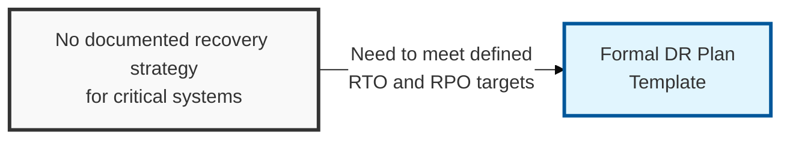
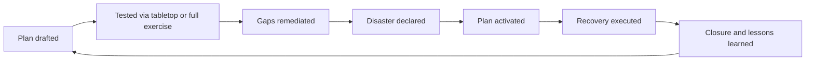

## I. Overview

**Definition**: A DR Plan Template is the operational runbook invoked once a disaster is declared: it lays out, per system or service, the recovery team, activation criteria, and the exact step-by-step procedure to restore operation within its target **RTO** (Recovery Time Objective) and **RPO** (Recovery Point Objective).

**Features**:  
( **Ownership** ) Drafted by the system or application owner in coordination with the DR coordinator.  
( **Source Material** ) Built from the DR Approach Document's strategy and the DR Asset Register's dependency data.  
( **Tested Artifact** ) The artifact actually tested in tabletop and full-failover exercises and executed during a real event.  
( **Beyond Strategy** ) A business cannot claim resilience on a strategy document alone — this is where that strategy becomes executable.

## II. Structure & Process

| Field | Description |
|---|---|
| System/Service in Scope | The application, database, or infrastructure component the plan covers. |
| Recovery Team & Roles | Named individuals or roles responsible for executing each recovery step. |
| Activation Criteria | Conditions under which this specific plan is invoked. |
| Step-by-Step Recovery Procedure | Ordered, executable instructions to restore the system. |
| Target RTO | Maximum acceptable downtime for this system. |
| Target RPO | Maximum acceptable data loss for this system. |
| Dependencies & Prerequisites | Upstream systems, credentials, or infrastructure that must be available first. |
| Test/Exercise History | Record of tabletop or full-failover exercises run against this plan and their outcomes. |

## III. Expected Benefits & Implications

| Benefit | Where It Shows Up |
|---|---|
| Faster actual recovery | Real-incident RTO vs. target, measured in the DR Closure Report |
| Less key-person dependency | Recovery executable by someone other than the primary system owner |
| Fewer surprises mid-recovery | Exercise findings closed before the next real activation, not discovered during it |

A DR plan is worth roughly what its most recent exercise says it's worth, not what its documentation looks like — a meticulously written runbook against a system that's been re-architected since the last full-failover test is a false sense of security dressed up as preparedness. The implication for planning is to budget the tabletop and full-failover cadence as a recurring cost of owning the system, the same as patching or backups, rather than a one-time deliverable that gets filed away once the plan is first approved.

Related: [DR Approach Document](../dr-approach-document/), [DR Asset Register](../dr-asset-register/), [DR Closure Report](../dr-closure-report/). See also [Cloud Backup & Recovery Testing Tracker](/docs/cloud-security/cloud-backup-recovery-testing-tracker/) for backup restore validation feeding this plan.
