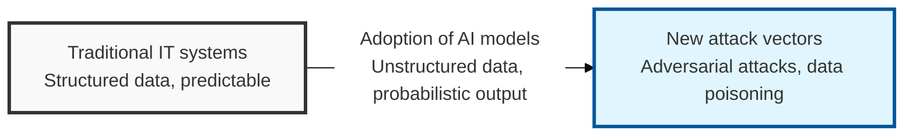
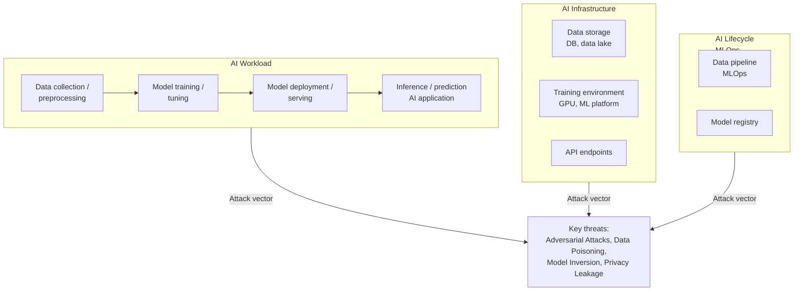

## I. Overview

**Definition**: A security framework and set of techniques for ensuring the confidentiality, integrity, and availability ( **CIA** ) of artificial intelligence ( **AI** ) models and the systems built around them.

**Features**:  
( **New attack vectors** ) AI-specific threats — such as adversarial attacks and data poisoning — exist and are difficult to defend against with conventional IT security alone.  
( **Data privacy** ) Strong protective measures are required against the leakage and re-identification of sensitive training data.  
( **Model integrity** ) Attacks that damage the integrity of the AI model itself or induce bias, causing malfunctions, must be prevented.  
( **Complex systems** ) Security considerations arise across the entire AI lifecycle: data collection, preprocessing, model training, deployment, and inference.

## II. Mechanism & Components

### AI System Attack Surface

### Key AI-Specific Attack Types

| Attack Type | Description | Threat |
|:---:|----------|----------|
| **Adversarial Attacks** | Adds subtle noise to input data to cause the model to malfunction | - **Evasion**: Causes a trained model's normal classification to fail (e.g., evading malware detection)  - **Perturbation**: Distorts classification results through minute changes (e.g., inducing image-classification errors) |
| **Data Poisoning** | Injects malicious data into the training data to degrade the model's performance or induce a specific outcome | - **Backdoor creation**: Induces an intended malfunction for a specific input  - **Performance degradation**: Reduces the model's overall accuracy |
| **Model Inversion / Extraction** | Infers or steals the structure or training data of a trained model | - **Training-data privacy breach**: Risk of leaking sensitive personal information  - **Model theft**: Leakage of proprietary technology or use in further attacks |
| **Privacy Violation** | Leakage of personal information from the data a model was trained on | Includes **Membership Inference Attacks**, among others |

## III. Adoption Considerations

| Lifecycle Stage | Key Risk | Primary Mitigation |
|---|---|---|
| Data collection / preprocessing | Data poisoning, training-data privacy leakage | Data integrity verification, **pseudonymization**, **differential privacy** |
| Model training / tuning | Adversarial attacks, model inversion / extraction | **Adversarial Training**, **Model Integrity Check** |
| Deployment / serving (API) | Unauthorized access, abuse of AI service endpoints | Access control, **rate limiting**, input/output validation |
| Inference / operation | Undetected model drift or anomalous behavior | Continuous monitoring, **UEBA**-based anomaly detection ( **AI for Security** ) |

Most AI-security budgets still concentrate on the deployment stage, because API access control and rate limiting look and feel like familiar IT controls. But the incidents that actually do damage — poisoned training data, leaked training-set PII — originate upstream, in a data pipeline that security teams are rarely invited to review. Treat the MLOps pipeline as security-in-scope from day one, not as infrastructure owned solely by the data-engineering team.
