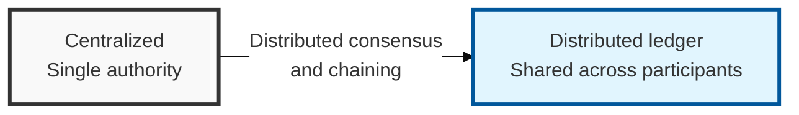
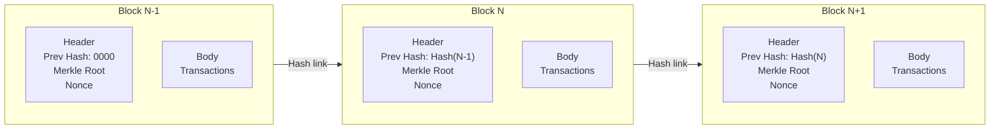

## I. Overview

**Definition**: A distributed ledger technology in which every network participant shares and cross-checks the transaction ledger, guaranteeing the transparency and integrity of the data.

**Features**:  
( **Decentralization** ) Transactions take place directly over a **P2P** network with no central administrator, eliminating any single point of failure ( **No SPoF** ) and ensuring availability.  
( **Integrity** ) Block chaining via hash functions and the **Merkle Root** prevent data tampering and forgery.  
( **Visibility** ) The ledger is open to every participant, maximizing the transparency and traceability of transactions.  
( **Irreversibility** ) Once recorded, information cannot be modified or deleted without distributed consensus, giving it strong evidentiary value after the fact.

## II. Mechanism & Components

### Block Structure and Chaining Mechanism

- **Block Header**: Contains the previous block's hash (Previous Hash), the Merkle Root, and a Nonce, maintaining the linkage between blocks.
- **Block Body**: The set of actual transaction records.
- **Merkle Root**: Summarizes individual transactions as a hash tree, enabling fast verification of whether data has been tampered with.

### Four Core Technologies of Blockchain Operation

| Technology | Description | Security Value |
|----------|---------|-----------|
| P2P Network | Direct communication between nodes with no central server | Availability (No SPoF) |
| Consensus Algorithm | Determines data agreement across distributed nodes (PoW, PoS, etc.) | Guarantees data consistency |
| Hash Function | Encrypts the previous block's information to link it to the next | Integrity (tamper prevention) |
| Smart Contract | Program code that executes automatically when specific conditions are met | Transaction trust and automation |

## III. Comparison & Application

| Category | Public | Private | Consortium |
|------|--------------|-----------------|---------------------|
| Participation | Open to anyone | Only authorized organizations/individuals | Predetermined set of institutions |
| Centralization | Fully decentralized | Centralized | Partially decentralized |
| Processing speed | Slow (consensus overhead) | Very fast | Fast |
| Incentive | Cryptocurrency reward required | Not required | Optional |
| Examples | Bitcoin, Ethereum | Enterprise supply-chain management | Financial-sector shared networks (R3 CEV) |

A private chain run and validated by a single company is, for most practical trust purposes, just a distributed database with extra steps — the trust model only meaningfully changes once governance and validator rights are genuinely shared across parties with competing interests, which is what a consortium chain is actually for. Pick public only when participants must transact without trusting each other or any operator; pick private or consortium when participants already have a legal relationship and simply need a shared, tamper-evident record of it.
