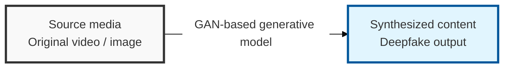
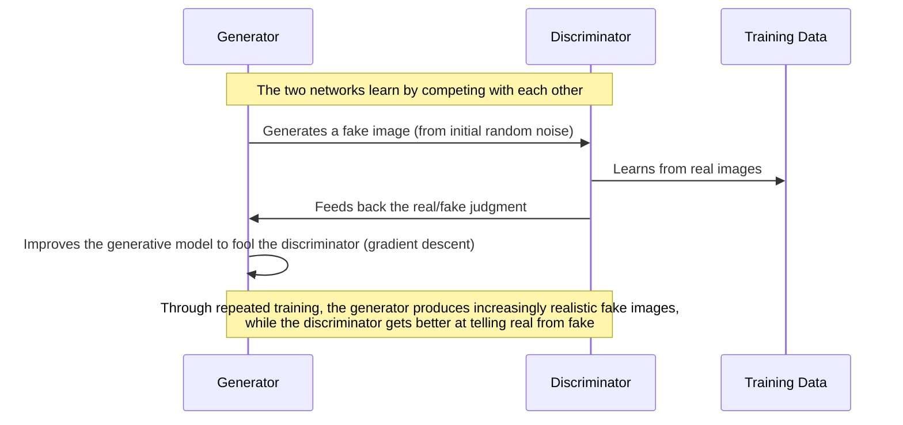

## I. Overview

**Definition**: Realistic fake video or audio content that uses deep learning — particularly **GANs** (Generative Adversarial Networks) — to synthesize or edit a specific person's face or voice.

**Features**:  
( **Realistic manipulation** ) Achieves a level of realism that is difficult to distinguish from genuine content, beyond what conventional image or video editing can produce.  
( **Malicious use** ) Increasingly used to spread fake news, commit defamation, carry out financial fraud ( **voice phishing** ), and fuel political disinformation, raising the risk of social disruption.  
( **Identity theft** ) A specific person's voice or face can be misappropriated without authorization and abused in impersonation crimes.

## II. Mechanism & Components

### GAN (Generative Adversarial Network)-Based Generative Model

### Deepfake Generation Process

1. **Data collection**: Gather a large volume of source data — the target person's face, expressions, voice, and so on — for training the **AI** model.
2. **Model training**: Use a **GAN** to learn the features of the source data and train a new model that synthesizes faces or voices.
3. **Content generation**: Feed inputs (a target face or voice) into the trained model to generate manipulated deepfake video or audio.
4. **Post-processing (optional)**: Edit and refine the generated content so it appears more natural.

## III. Advanced Topics & Comparison

### Deepfake Detection Techniques

- **AI-based analysis**: AI models detect subtle visual or auditory inconsistencies in generated content, such as unnatural blinking, unnatural expressions, or traces of voice alteration.
- **Watermarking**: Invisible identifying information is embedded in source data at creation time so authenticity can be verified later.
- **Digital provenance**: Technology — including **blockchain** — is used to record and trace a piece of content's creation, editing, and distribution history.

### Legal and Institutional Response

- **Stronger anti-abuse laws**: Strengthening penalties for defamation, the production and distribution of illicit material, and election interference carried out using deepfakes.
- **Greater platform responsibility**: Requiring social media and other distribution platforms to detect deepfakes and block their spread.
- **Security awareness**: Expanding public education and outreach on the dangers of deepfakes and how to identify them.

> **Key point**: As deepfakes grow more sophisticated alongside advancing technology, defense requires combining **AI-based detection technology** with **legal and institutional regulation**.
