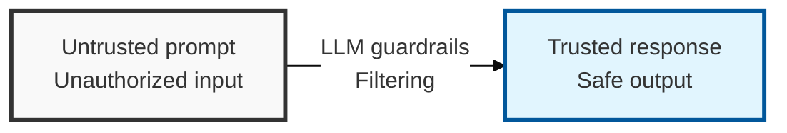
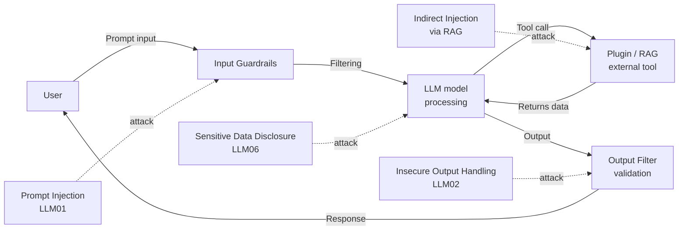

## I. Overview

**Definition**: A multi-layered defense framework for detecting and blocking vulnerabilities specific to large language model ( **LLM** ) applications, such as prompt injection and data disclosure.

**Features**:  
( **Non-deterministic threats** ) Bypass attacks, such as prompt injection, exploit the model's characteristic of producing variable output depending on the input.  
( **Expanded attack surface** ) Integration with external data ( **RAG** ) and plugins increases the threat of indirect prompt injection ( **Indirect Injection** ).  
( **Data protection** ) Defenses are needed against disclosure, where sensitive information embedded in training data is exposed externally through the generation process.

## II. Mechanism & Components

### LLM Application Threat Modeling

> **Key point**: The entire path — from user prompt input, through model processing, to integration with external tools (plugins/RAG) — is an attack surface.

### Key OWASP Top 10 for LLM Items and Countermeasures

| Rank | Key Item | Description and Countermeasures |
|------|----------|----------------------|
| LLM01 | Prompt Injection | Crafted input that bypasses the model's guardrails or triggers malicious behavior (direct or indirect) |
| LLM02 | Insecure Output Handling | Executing model output without validation, enabling secondary attacks such as XSS or SSRF (output filtering is essential) |
| LLM06 | Sensitive Data Disclosure | Sensitive information leaking through training data or RAG (mitigated by data de-identification and PII filtering) |
| Other | Training Data Poisoning | Injecting malicious data into training data to induce bias or a backdoor in the model |

## III. Outlook & Future Direction

| Control Category | Maturity | Direction |
|---|---|---|
| Prompt-injection input filtering | Early, heuristic-based | Converging toward structured separation of instructions and untrusted data |
| Output/guardrail frameworks (e.g., NeMo-Guardrails) | Growing adoption | Becoming the primary real-time enforcement layer at both input and output |
| Human-in-the-loop ( **HITL** ) review | Manual, applied selectively | Shifting toward risk-based triggers rather than blanket review of every response |

The security community is converging on a conclusion the AI-safety community reached earlier: prompt injection can't be fully solved at the input-filtering layer, because there is no reliable way to separate "instruction" from "data" once both arrive as plain text. The more durable investment is constraining what a compromised LLM call can *do* next — output validation before any action executes, and human review reserved for consequential actions — rather than betting the defense on ever-better input classifiers.
