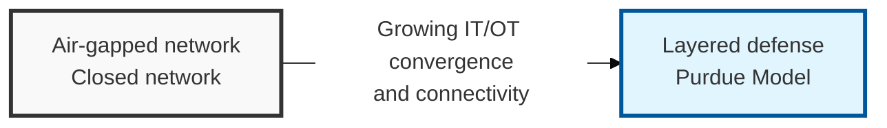
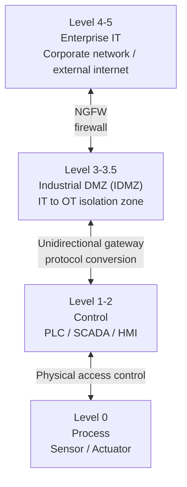

## I. Overview

**Definition**: A security framework for protecting the operational technology ( **OT** ) and industrial control systems ( **ICS** ) that run national infrastructure and industrial processes — manufacturing, energy, transportation, and more — from cyber threats.

**Features**:  
( **Availability first** ) Unlike IT security, which prioritizes confidentiality, OT security's top priority is uninterrupted, 24/7 operation and service continuity ( **Availability** ).  
( **Safety-centric** ) Because a cyberattack can translate directly into a physical accident, ensuring the safety ( **Safety** ) of people and equipment is essential.  
( **Limits of the air gap** ) To respond to the breakdown of air-gapped environments, layered network segmentation and control based on the **Purdue** model is applied.

## II. Mechanism & Components

### Purdue Model-Based OT/ICS Network Structure

> **Key point**: Layers are separated from Level 0 (field devices) up to Level 5 (enterprise network), with the **Industrial DMZ (IDMZ)** isolating the IT and OT segments.

### Components and Security Measures by Level

| Level | Name and Components | Key Security Measures |
|:-----------:|----------------|------------------|
| Level 4-5 | Enterprise (IT) | Corporate network and external connectivity segment; apply next-generation firewalls (NGFW) |
| Level 3-3.5 | Site Operations (IDMZ) | Intermediate buffer zone; patch management servers, data replication, strengthened authentication |
| Level 1-2 | Control (PLC, SCADA) | Control-loop segment; whitelist-based intrusion detection, protocol inspection |
| Level 0 | Process (Sensor/Actuator) | Field physical devices; physical access control and monitoring for equipment anomalies |

## III. Adoption Considerations

| Risk | Mitigation |
|---|---|
| Vendor-specific industrial protocols (Modbus, S7, EtherNet/IP) evade generic IT security tools | Deep packet inspection (DPI) tuned to industrial protocols |
| Air-gap assumption broken by USB drives, maintenance laptops, or remote vendor access | Zero-trust device authentication at the point of connection, not just at the network perimeter |
| Inconsistent security baseline across vendors and integrators | Governance and certification under IEC 62443 |

Most OT breaches attributed to "the air gap failed" actually trace back to a maintenance laptop or USB drive that was trusted simply because it was physically present on-site. The fix isn't a tighter perimeter — it's authenticating every device at the point of connection, regardless of how it got there. Treat physical proximity to a Level 0/1 asset as zero evidence of trustworthiness.
