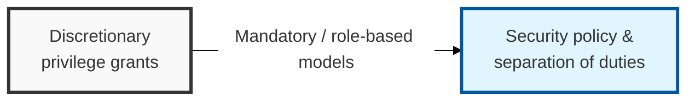
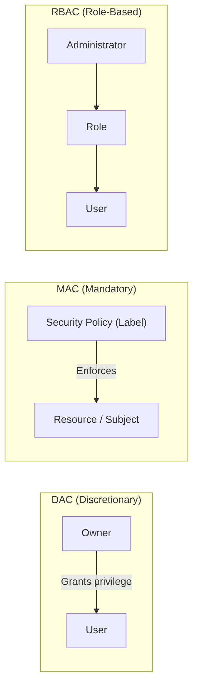

## I. Overview

**Definition**: A policy framework that restricts access rights to resources within a system according to a subject's identity, security clearance, or role, in order to block unauthorized access.

**Features**:  
( **Least Privilege** ) Grants only the minimum privileges truly required for a duty or role, preventing insider threats and containing the spread of incidents  
( **Separation of Duties** ) Separates the execution of key tasks from the authority to approve them, cutting off fraud and misuse at the source  
( **Centralized Control** ) Verifies and approves access to every resource from a single point under a consistent security policy  

## II. Mechanism & Components

### A. Architecture Comparison Across Access Control Models

> **Explanation**: In **DAC**, the owner grants privileges; **MAC** is enforced by the system through security labels; **RBAC** manages access through an intermediate "**role**" layer.

### B. Technical Characteristics Comparison

| Item | Discretionary Access Control (DAC) | Mandatory Access Control (MAC) | Role-Based Access Control (RBAC) |
|------|--------------------|--------------------|----------------------|
| Full Name | Discretionary Access Control | Mandatory Access Control | Role-Based Access Control |
| **Basis for Decision** | Subject's identity | Security label / clearance | User's role |
| **Privilege Granting** | Decided at the discretion of the resource owner | Enforced uniformly by the system / administrator | Central administrator assigns roles |
| **Security** | Low (privileges can be misused) | Very high (cannot be bypassed) | Moderate to high (supports separation of duties) |
| **Flexibility** | Very high (user-centric) | Low (management overhead on change) | High (adapts easily to organizational change) |
| **Typical Use** | Windows / Linux file permissions | Defense, government agencies (multilevel security) | General enterprise (ERP), financial industry |

## III. Comparison by Type & Selection Criteria

| Model | Best Fit | Trade-off |
|:---:|----------|-----------|
| **DAC** | Small teams, general-purpose OS file sharing | Flexible, but relies on every owner making a good judgment call |
| **MAC** | Defense, government, multilevel classified systems | Strongest guarantee available, but rigid and costly to operate |
| **RBAC** | Mainstream enterprise systems (ERP, financial services) | Balances security and manageability, but role design debt accumulates over time |

In practice, RBAC wins the default slot for nearly every enterprise system built today — not because it is the most secure of the three, but because it is the only one that scales with organizational change: a new hire or transfer becomes a role reassignment instead of a manual ACL rewrite. Reserve MAC for the narrow band of systems that genuinely require it (classified data, weapons systems) and DAC for low-stakes, user-owned resources; treating RBAC as the safe default and the other two as deliberate exceptions keeps an organization's access model consistent enough to actually audit.
