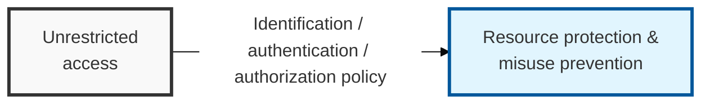

## I. Overview

**Definition**: The set of policies and technical means that check whether a subject has the appropriate privileges when it attempts to access an object, and that allow or deny the attempt accordingly.

**Features**:  
( **Confidentiality** ) Blocks access by unauthorized subjects, preventing information from leaking outside  
( **Integrity** ) Restricts unauthorized users from modifying or deleting data, protecting the accuracy of information  
( **Availability** ) Ensures that users with legitimate privileges can always access resources whenever they need to  

## II. Mechanism & Components

### A. Access Control Model Structures

| Category | Discretionary Access Control (DAC) | Mandatory Access Control (MAC) | Role-Based Access Control (RBAC) |
|------|--------------------|--------------------|----------------------|
| **Controlling Party** | Resource owner | Administrator / system | Central administrator |
| **Basis for Decision** | Subject's identity | Security label | User's role |
| **Characteristics** | Easy to implement, flexible | Strongest security | High management efficiency |
| **Advantages** | Maximizes user convenience | Guarantees data integrity / confidentiality | Easy to manage user transfers / reinstatement |
| **Disadvantages** | Vulnerable to Trojan horses, etc. | Complex to implement, inconvenient for users | Initial cost of role design |
| **Examples** | Windows file permissions, ACLs | Military systems, national defense security | Enterprise ERP, general business |

### B. Technical Mechanisms of Access Control

- **Access Control Matrix**: A table that records privileges by organizing subjects and objects into rows and columns
- **CL (Capability List)**: Manages the list of objects a subject can access, organized from the subject's perspective
- **ACL (Access Control List)**: Manages the list of subjects that can access an object, organized from the object's perspective

## III. Trends & Future Direction

| Approach | Status | Direction |
|---|---|---|
| DAC / MAC / RBAC | Established, still the operational baseline | Remain the enforcement layer, not replaced outright |
| ABAC (Attribute-Based) | Growing adoption in cloud/IAM platforms | Becoming the default for context-sensitive, dynamic authorization |
| Zero Trust | Widely adopted as an architectural principle | Assumed baseline for new network and application design |

Static role-based models are not going away, but they are increasingly just one input into a broader decision — ABAC and Zero Trust don't replace RBAC so much as wrap it, layering time, location, and device posture on top of the role a user already holds. The practical shift for most organizations is less "adopt ABAC" as a discrete project and more a continuous move toward evaluating access at the moment of the request rather than at the moment of role assignment; teams that keep treating access control as a one-time provisioning event will fall behind this shift.
