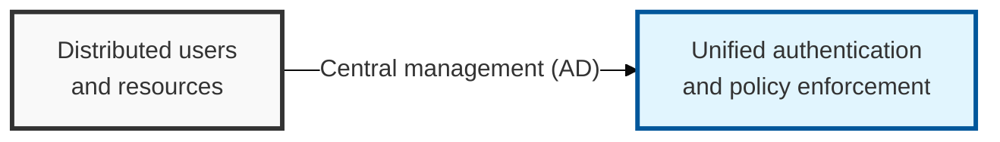
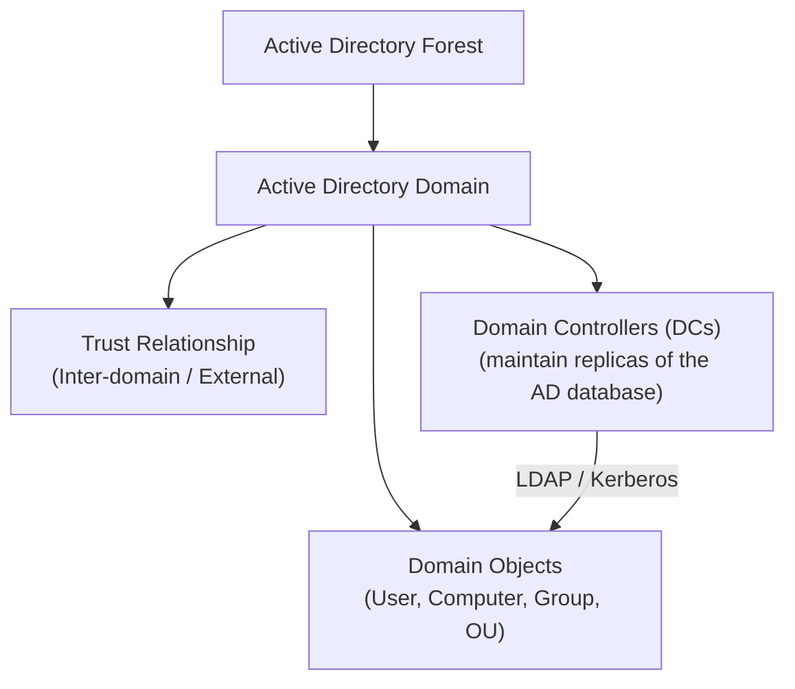

## I. Overview

**Definition**: A directory service developed by Microsoft that centrally manages information about the users, computers, groups, and resources on a network, and that serves as the core infrastructure for controlling authentication and access rights.

**Features**:  
( **Centralized Management** ) Provides a unified management environment for IT resources such as user accounts, password policies, and computer settings  
( **Single Sign-On (SSO)** ) A single authentication grants access to multiple applications and resources, increasing both convenience and security  
( **Access Control** ) Applies **RBAC** (Role-Based Access Control)-based security policy through fine-grained, per-resource permission settings  
( **Authentication Protocol** ) Uses a strong **Kerberos**-based authentication mechanism to guarantee secure communication  

## II. Mechanism & Components

### A. Key Components of AD

- **Domain**: AD's basic administrative unit — a set of computers and users that share the same security policy and trust relationships
- **Forest**: The top-level logical structure of AD, containing one or more domains; each domain maintains its own security boundary
- **Tree**: A set of domains that share a contiguous **DNS** namespace
- **Domain Controller (DC)**: Maintains a replica of the AD database (**NTDS.DIT**) and processes authentication and authorization requests
- **Domain Object**: Individual pieces of information in the AD database, such as user accounts, computer accounts, groups, and organizational units (**OU**)

### B. Authentication and Authorization Mechanism (Kerberos)

1. **User authentication**: The user obtains a **TGT** (Ticket Granting Ticket) from the **KDC** (Key Distribution Center) (**AS** — Authentication Service)
2. **Service ticket request**: Using the TGT, the user requests an **ST** (Service Ticket) to access a specific service, such as a file server (**TGS** — Ticket Granting Service)
3. **Service access**: The user presents the ST to the target server to obtain authentication and access privileges (**AP** — Application Server)

## III. Advanced Topics & Comparison

### A. AD Vulnerabilities and Attack Types

- **AD privilege theft**: Gaining administrator privileges through techniques such as **Kerberoasting**, **Pass-the-Hash**, and **Golden Ticket** attacks
- **Insider threats**: Leaked credentials, misuse of privileges, or exploitation of misconfiguration
- **Malware infection**: Malware that spreads within the **AD** environment and exfiltrates data

### B. Essential Security Hardening Measures

- **Least privilege**: **RBAC**-based role separation and fine-grained permission management via a **GPO** (Group Policy Object) per **OU**
- **Strong authentication**: Adopt **MFA**, limit Kerberos ticket lifetimes, and apply **LAPS** (Local Administrator Password Solution)
- **Continuous monitoring**: Analyze **AD** audit logs, integrate with a **SIEM**, and build detection/response for abnormal access patterns
- **Security patching and updates**: Keep the **DC** and related components such as **AD CS** (Certificate Services) on the latest security updates

> **Key Point**: Because **Active Directory** is the foundation of an organization's IT infrastructure, rigorous security configuration and continuous monitoring are essential to keeping the **AD** environment safe.
