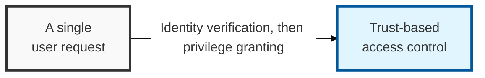
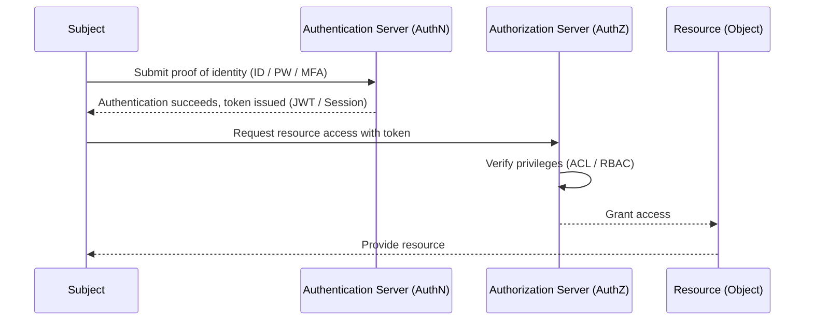

## I. Overview

**Definition**: Authentication verifies who a subject claims to be, while authorization determines what an authenticated subject is permitted to do — two distinct but sequential steps in access control.

**Features**:  
( **Identity Verification (Authentication)** ) Confirms whether a subject's claimed identity is genuine, establishing trust at the system's entry point  
( **Privilege Control (Authorization)** ) Defines the scope of an authenticated user's actions and grants resource access under the principle of least privilege  
( **Security Visibility** ) Authentication and authorization logs trace a subject's activity and provide accountability when incidents occur  

## II. Mechanism & Components

### A. Relationship Between Authentication and Authorization

> **Explanation**: When a subject makes an access request, its identity is first verified through authentication; the resulting token or session is then used by the authorization server to decide whether access is permitted.

### B. Key Comparison Points

| Comparison Item | Authentication | Authorization |
|----------|----------------------|-------------------|
| **Core Question** | "Who are you?" | "What are you allowed to do?" |
| **Sequencing** | A prerequisite for authorization (performed first) | Performed after authentication completes |
| **Implementing Technologies** | ID/PW, MFA, FIDO, biometric authentication | ACL, RBAC, OAuth 2.0, IAM policies |
| **What Is Presented** | Credentials | Proof of authorization (access token, scope) |
| **Result on Failure** | 401 Unauthorized (identity not confirmed) | 403 Forbidden (insufficient privileges) |

## III. Advanced Topics & Comparison

### A. Evolution of Authentication: Passkeys and MFA

- **MFA (Multi-Factor Authentication)**: Combines two or more of knowledge (password), possession (OTP), and inherence (biometrics)
- **FIDO2 / Passkey**: Implements a passwordless environment, cutting off phishing attacks at the source

### B. Evolution of Authorization: OAuth 2.0 and ABAC

- **OAuth 2.0**: Delegates only resource-access privileges to third-party applications without exposing the user's password
- **ABAC (Attribute-Based)**: Dynamic authorization based on attributes beyond just job title — including access time, location, and device security posture
