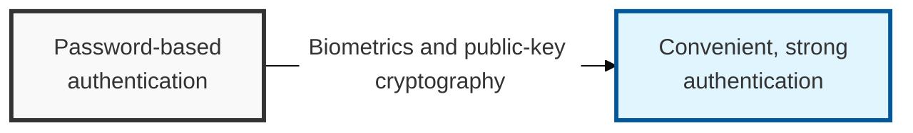
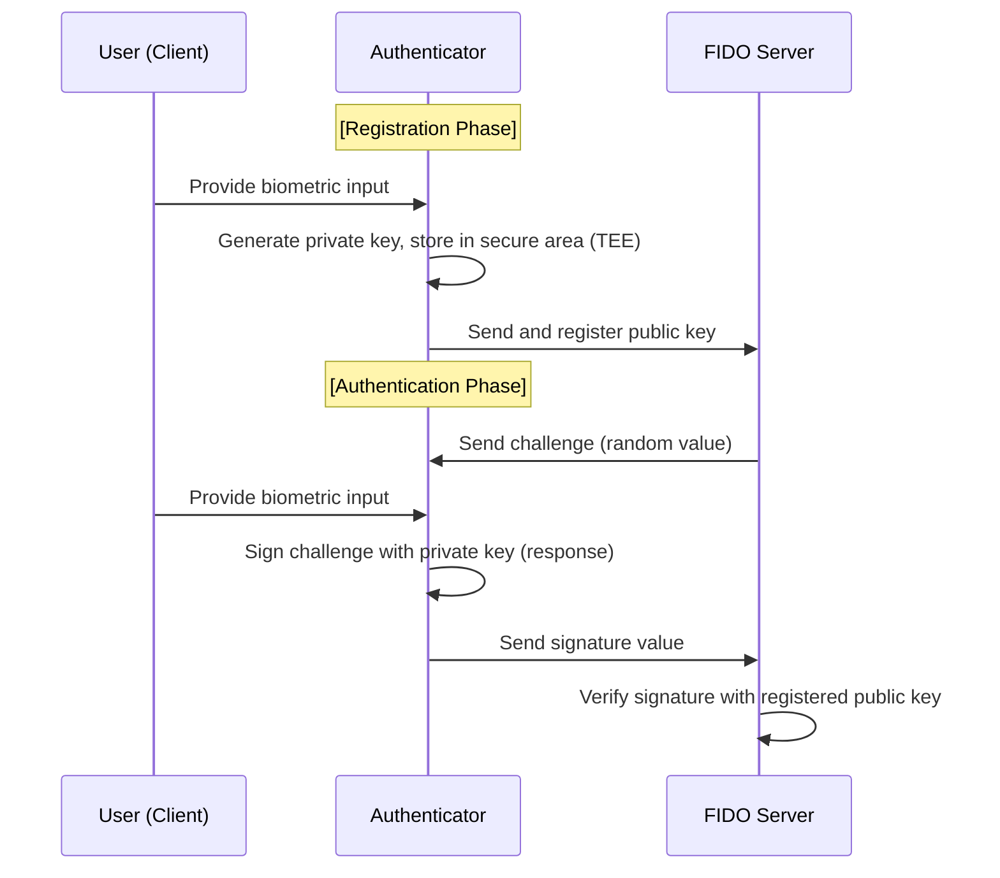

## I. Overview

**Definition**: FIDO (Fast IDentity Online) is an authentication standard that replaces password-based login with device-held biometric verification and public-key cryptography.

**Features**:  
( **Stronger Security** ) Replaces passwords, which risk exposure, with biometric-based, public-key authentication — cutting off phishing and account-takeover attacks at the source  
( **Privacy Protection** ) Biometric data is never sent to the server; it stays only within the device's secure storage area, preventing leakage  
( **User Convenience** ) Authenticates quickly through a simple action such as a fingerprint or facial scan, with no complex password to type  

## II. Mechanism & Components

### A. FIDO Authentication Process (Registration & Authentication)

**Detailed steps**:
- **Registration**: After biometric authentication on the device, the resulting public key is registered with the server (the private key stays in the device's secure area, the TEE)
- **Authentication**: The device signs the challenge sent by the server using the private key and returns the response
- **Verification**: The server verifies the signature with the registered public key to confirm authentication success

### B. Key Differences Across FIDO Standard Versions

| Category | FIDO 1.0 (UAF / U2F) | FIDO 2.0 (WebAuthn) |
|:---:|---------------------|--------------------|
| **Primary Target** | Mainly mobile app environments | Web browser and PC environments |
| **UAF** | Login using biometrics alone (**Passwordless**) | - |
| **U2F** | An added security key on top of ID/PW (**2nd Factor**) | - |
| **Core Technology** | Requires a dedicated client app | **WebAuthn** (W3C standard API), **CTAP** |
| **Extensibility** | Tied to a specific OS / device | General-purpose, browser-based authentication |

## III. Advanced Topics & Comparison

| Category | Details | Expected Benefit |
|:---:|----------|----------|
| **Biometric Data Protection** | Biometric data is never sent to the server and stays on-device | Biometric data cannot leak even if the server is breached |
| **Phishing Prevention** | Domain-binding technology blocks authentication on fake sites | Blocks man-in-the-middle (MitM) attacks and phishing at the source |
| **Passkey** | Syncs FIDO credentials across multiple devices | Seamless authentication experience even after a device change |
