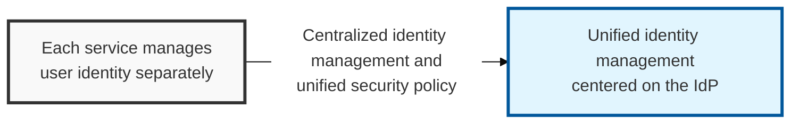
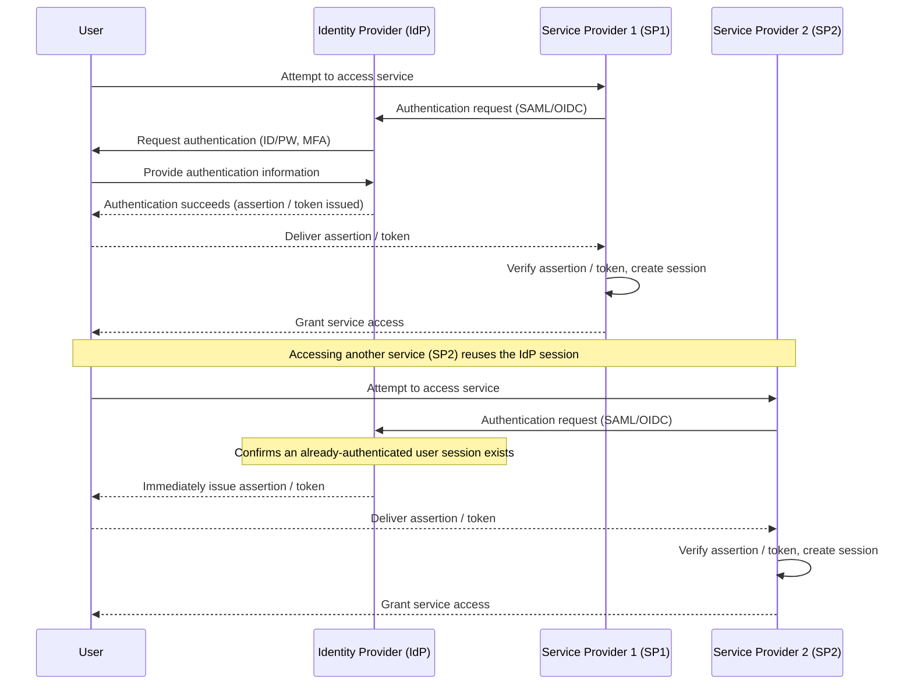

## I. Overview

**Definition**: A trusted authority that manages user authentication information and, once a user is successfully authenticated, issues a security token (an assertion or token) that a relying service provider (**SP**) can trust.

**Features**:  
( **Central Authentication** ) A user authenticates once at the **IdP** and can then access every connected **SP** — the core mechanism behind **SSO**  
( **Identity Information Delivery** ) Securely passes a user's identity information (name, email, etc.) to the **SP** for account creation and login  
( **Standards Compliance** ) Uses standard protocols such as **SAML** and **OpenID Connect** to guarantee secure, interoperable communication with the **SP**  
( **SSO Ecosystem** ) Unifies authentication across multiple services, improving the user experience and the efficiency of security management  

## II. Mechanism & Components

### A. Federated Identity Authentication Flow

### B. Major SSO Protocols and the IdP's Role

| Protocol | IdP's Role | SP's Role |
|:---:|----------|----------|
| **SAML** | Generates and issues the **SAML Assertion** | Receives and verifies the **SAML Assertion** |
| **OpenID Connect** | Issues the **ID Token** and **Access Token** | Receives and verifies the **ID Token** / **Access Token** |
| **OAuth 2.0** | Issues the **Access Token** (acts as the authorization server) | Receives the **Access Token** and checks resource-access privileges |

## III. Advanced Topics & Comparison

### A. Why IdP Security Matters, and Potential Threats

- **Single Point of Failure**: If the **IdP** goes down, every connected service becomes unusable
- **Centralized Attack Target**: Compromising the **IdP** account can grant access to every connected service (credential stuffing, phishing, etc.)
- **Token/Assertion Vulnerabilities**: Flawed verification logic or reuse of a stolen token can lead to session hijacking

### B. IdP Security Hardening Best Practices

- **Strong Authentication Mechanisms**: Apply **MFA** (Multi-Factor Authentication), password policies, and **SSO** session timeouts
- **Protocol Security**: Require **HTTPS**, thoroughly verify the signature and encryption of SAML/OIDC assertions and tokens
- **Access Control and Logging**: Minimize access to the **IdP** admin console; keep detailed audit logs and monitoring
- **Regular Vulnerability Reviews**: Apply the latest security patches to the **IdP** solution and conduct periodic security audits

> **Key Point**: Because the **IdP** is an organization's identity management hub, maintaining strong security for the **IdP** itself and safely configuring every connected **SP** are both essential to overall security.
