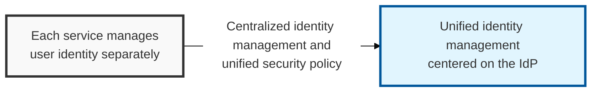
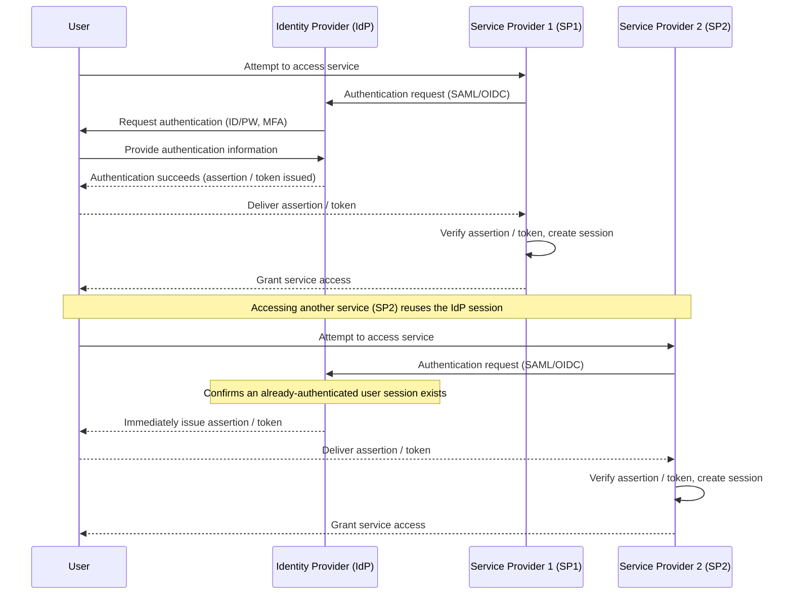

## I. Overview

**Definition**: A trusted authority that manages user authentication information and, once a user is successfully authenticated, issues a security token (an assertion or token) that a relying service provider (**SP**) can trust.

**Features**:  
( **Central Authentication** ) A user authenticates once at the **IdP** and can then access every connected **SP** — the core mechanism behind **SSO**  
( **Identity Information Delivery** ) Securely passes a user's identity information (name, email, etc.) to the **SP** for account creation and login  
( **Standards Compliance** ) Uses standard protocols such as **SAML** and **OpenID Connect** to guarantee secure, interoperable communication with the **SP**  
( **SSO Ecosystem** ) Unifies authentication across multiple services, improving the user experience and the efficiency of security management  

## II. Mechanism & Components

### A. Federated Identity Authentication Flow

### B. Major SSO Protocols and the IdP's Role

| Protocol | IdP's Role | SP's Role |
|:---:|----------|----------|
| **SAML** | Generates and issues the **SAML Assertion** | Receives and verifies the **SAML Assertion** |
| **OpenID Connect** | Issues the **ID Token** and **Access Token** | Receives and verifies the **ID Token** / **Access Token** |
| **OAuth 2.0** | Issues the **Access Token** (acts as the authorization server) | Receives the **Access Token** and checks resource-access privileges |

## III. Expected Benefits & Implications

Centralizing authentication behind an IdP pays off most clearly at the moments organizations tend to underestimate: onboarding and offboarding. Provisioning a new hire's access to every connected **SP** becomes a single account creation instead of N separate signups, and revoking a departing employee's access becomes a single account disable instead of a checklist that's easy to leave incomplete.

| Benefit | Where It Shows Up |
|---|---|
| Faster onboarding/offboarding | Time-to-provision and time-to-deprovision across every connected SP |
| Consistent security policy | One place to enforce MFA, password rules, and session timeouts |
| Reduced credential sprawl | Fewer help-desk password resets, fewer reused passwords across services |

The implication organizations tend to miss is that centralizing authentication also centralizes risk — an IdP is worth adopting specifically because it concentrates control, but that same concentration means IdP security investment (MFA, monitoring, admin console access) should scale ahead of the number of services it connects, not after.
