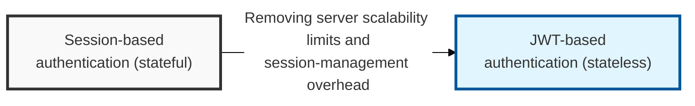
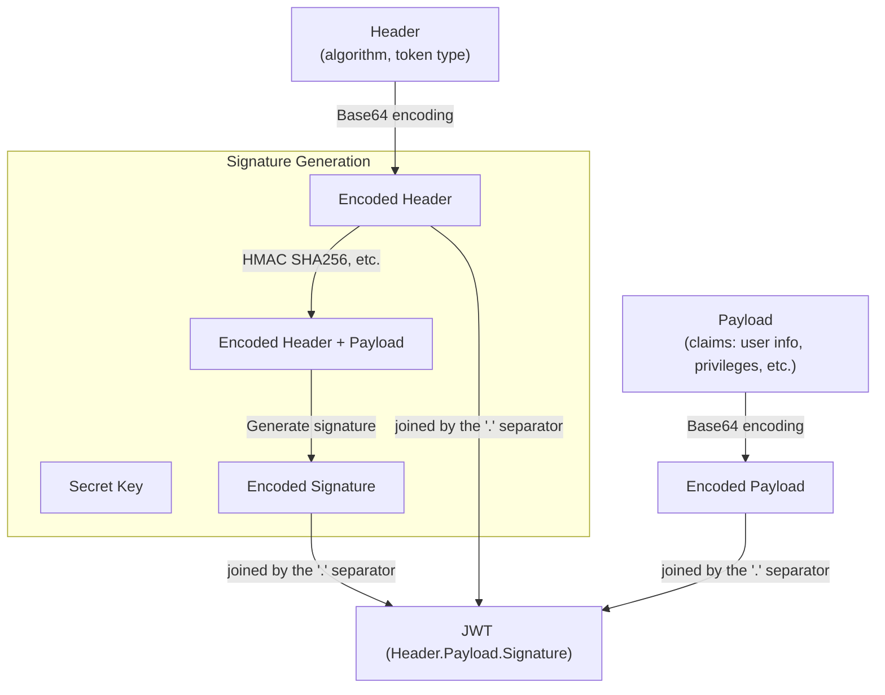

## I. Overview

**Definition**: An open standard (RFC 7519) for securely representing information in JSON form using a digital signature or encryption, used mainly for **SSO** (Single Sign-On) and exchanging authentication data in web environments.

**Features**:  
( **Stateless Authentication** ) The server can authenticate a user and verify their information from the JWT alone, without storing any client state  
( **Compact Structure** ) A lightweight JSON format that is easy to transmit — for example, through HTTP headers — making it well suited to web environments  
( **Extensibility** ) Follows a standardized structure (**Header**, **Payload**, **Signature**) and can carry a wide variety of claims flexibly  
( **Security** ) A digital signature authenticates the issuer and prevents tampering with the token's contents  

## II. Mechanism & Components

### A. The Three Parts of a JWT: Header, Payload, Signature

- **Header**: Contains the token type (**JWT**) and the algorithm used for signing (**alg**: HS256, RS256, etc.)
- **Payload**: The token's actual content — claims such as the subject identifier (**sub**), issuer (**iss**), expiration time (**exp**), and scope (**scope**)
- **Signature**: Generated by encrypting the **Header** and **Payload** with a **Secret Key** or **Private Key**; verifies the integrity of the **Payload** using the algorithm named in the **Header** together with the **Secret Key**

### B. JWT Issuance and Verification Process

1. **Login request**: The user requests a login with an ID/password
2. **JWT issuance**: The server generates the **Header** and **Payload** from the user's information, creates the **Signature** with the **Secret Key**, and issues the JWT
3. **Client storage**: The client stores the issued JWT in local storage (**localStorage**) or a cookie (**Cookie**)
4. **On API requests**: The client sends the stored JWT to the server in the HTTP header (**Authorization: Bearer \<token\>**)
5. **Server verification**: The server verifies the received JWT's **Signature** using the **Secret Key** and checks the **Payload**'s information (expiration, scope, etc.) before processing the request

## III. Vulnerabilities & Security Measures

| Attack Vector | Primary Control |
|---|---|
| `alg: none` / algorithm confusion | Enforce the expected algorithm server-side; never trust the `alg` field in the token header |
| Secret key exposure (HMAC) | Store the key safely, rotate it, or move to RS256 (asymmetric) |
| Payload exposure (Base64, not encryption) | Never place sensitive data in the payload |
| Unverified expiration / stolen token reuse | Always check `exp`; keep token lifetimes short |
| Client-side storage (XSS via localStorage) | Prefer an HttpOnly cookie over localStorage |

The single most common JWT implementation bug is trusting the algorithm the token claims to use instead of the one the server expects — a library that blindly honors the `alg` header can be tricked into verifying an RS256-signed system with the public key treated as an HMAC secret, letting an attacker forge tokens at will. Hard-code the expected algorithm in verification code rather than reading it from the token, and treat RS256 as the default choice for anything beyond a single trusted backend.
