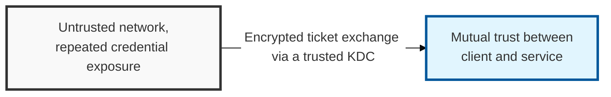
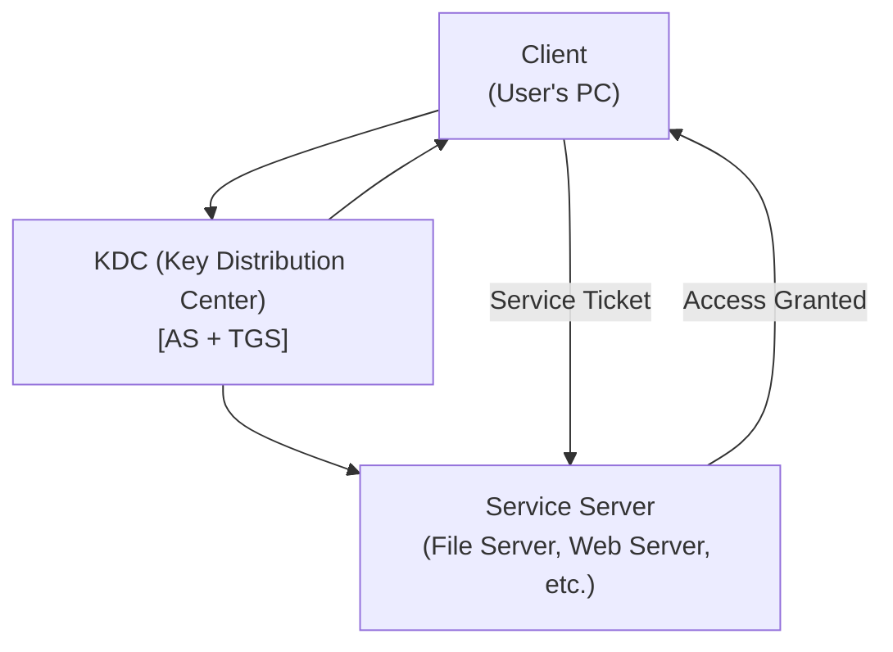

## I. Overview

**Definition**: A network authentication protocol developed at MIT that uses cryptographic **tickets** to securely verify the identities of a user (client) and a service (server) within a mutually trusted environment.

**Features**:  
( **Encryption-Based Authentication** ) Encrypts tickets (**TGT**, **ST**) to prevent user information and session keys from being exposed during communication  
( **Single Sign-On (SSO)** ) A single authentication grants access to multiple services without repeated logins, improving user convenience  
( **Delegated Trust** ) Builds mutual trust between users and services through a trusted third party called the **KDC** (Key Distribution Center)  
( **Security Foundation** ) As the default authentication method for **Active Directory**, Kerberos raises the overall security level of the network environment  

## II. Mechanism & Components

### A. Core Components of the Kerberos Protocol

- **Client**: The user or service requesting authentication (for example, the PC a user logs into)
- **KDC (Key Distribution Center)**: The central server of Kerberos authentication, made up of the **AS** and the **TGS**
  - **AS (Authentication Server)**: Handles the user's initial authentication and issues the **TGT** (Ticket Granting Ticket)
  - **TGS (Ticket Granting Server)**: Verifies the user's **TGT** and issues an **ST** (Service Ticket) for access to a specific service
- **Application Server**: Verifies the user's **ST** and grants access to the service

### B. Ticket-Exchange Authentication Process

1. **User authentication (AS)**: The user presents an ID/password to the **AS** on the **KDC** → the **AS** issues a **TGT** and a session key, both encrypted with the user's secret key
2. **Service ticket request (TGS)**: The user submits the **TGT** and the target service information to the **TGS** on the **KDC** → after verifying the **TGT**, the **TGS** issues an **ST** and a service session key, encrypted with the service's secret key
3. **Service access (AP)**: The user presents the **ST** and the service session key to the target service server → after verifying the **ST**, the server provides the service

## III. Vulnerabilities & Security Measures

| Attack Vector | Primary Control |
|---|---|
| Kerberoasting (offline cracking of an SPN account's TGS ticket) | Strong, randomly generated service-account passwords; migrate to gMSA where possible |
| Pass-the-Hash / Pass-the-Ticket | Restrict lateral movement, enable Credential Guard, limit where privileged accounts can log on |
| Golden Ticket (forged TGT via a compromised KDC/krbtgt account) | Protect and periodically rotate the krbtgt account; monitor for anomalous TGT issuance |
| Clock-skew authentication failure | Enforce NTP synchronization across all domain members |

Kerberos itself is cryptographically sound — nearly every practical attack against it, Kerberoasting and Golden Ticket included, targets a weak service-account password or a poorly protected KDC rather than a flaw in the protocol's design. That makes Kerberos security really a matter of Active Directory operational hygiene in disguise: rotating the krbtgt account and enforcing strong service-account passwords does more for real-world security than any Kerberos-specific configuration change.
