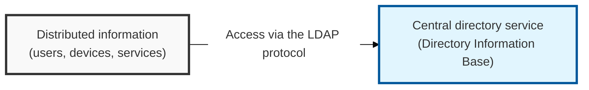
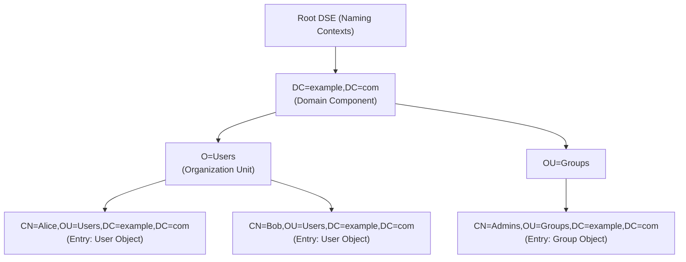

## I. Overview

**Definition**: A standard communication protocol for accessing a directory service, used to store and search information about network resources — users, devices, services, and more — in a hierarchical structure.

**Features**:  
( **Standard Protocol** ) Based on the **X.500** standard but simplified, and widely used to implement a variety of directory services  
( **Hierarchical Structure** ) Organizes information as a tree using a **DN** (Distinguished Name), enabling efficient search and management  
( **Optimized for Lookups** ) Optimized for read operations, making it effective for tasks such as user authentication and address-book lookups  
( **Extensibility** ) Schema extensions allow it to store and manage many different types of information (supported in **LDAP**v3)  

## II. Mechanism & Components

### A. LDAP Directory Structure

- **DN (Distinguished Name)**: The path that uniquely identifies each entry in the directory (for example, `CN=Alice,OU=Users,DC=example,DC=com`)
- **RDN (Relative Distinguished Name)**: The final component of a DN, which uniquely identifies an entry within its immediate parent (for example, `CN=Alice`)
- **Attribute**: The information held by each entry (for example, `cn=Alice`, `uid=alice`, `mail=alice@example.com`)
- **Schema**: Defines the object classes and attributes — and the rules governing them — that can be stored in the directory

### B. LDAP Operations (LDAPv3)

- **Binding**: The client authenticates to the directory server (anonymous, or simple/SASL authentication)
- **Search**: Queries entries matching a given filter (specifying the base DN, scope, filter, and attributes)
- **Add/Modify/Delete**: Changes information held in directory entries
- **Unbind**: Terminates the client connection

## III. Advanced Topics & Comparison

### A. LDAP Security Threats

- **Credential theft**: Credentials can leak when using plaintext transport (LDAP) or weak authentication methods
- **Information disclosure**: Sensitive directory information can be exposed if anonymous binding is allowed
- **Denial of Service (DoS)**: Server resources can be exhausted by inefficient queries or an excessive number of connection requests
- **LDAP injection**: Similar to SQL injection — manipulating an LDAP query to attempt unauthorized access

### B. Security Hardening

- **Use LDAPS/StartTLS**: Encrypt LDAP traffic with **SSL/TLS** to protect data in transit
- **Disable anonymous binding**: Block unnecessary anonymous access, and require strong authentication (**SASL** or simple bind with credentials) when binding
- **Least privilege**: Use access control lists (**ACL**s) to restrict per-user/per-group read/write privileges on the directory
- **Query optimization and filtering**: Limit inefficient or overly broad search scopes, and detect malicious filter strings
- **Regular auditing and monitoring**: Periodically review abnormal access attempts and change history

> **Key Point**: Because LDAP is core infrastructure for authentication and access control, security must be applied rigorously — **LDAPS/StartTLS**, **ACL**-based privilege management, and **SASL** authentication among them.
