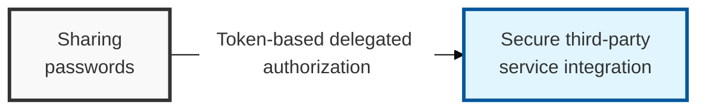

## I. Overview

**Definition**: An open standard protocol that lets a third-party application access a resource on a user's behalf — through delegation — without ever exposing the user's password.

**Features**:  
( **Password Protection** ) Delegates only safe resource-access privileges to third-party apps, without ever exposing the user's password  
( **Fine-Grained Authorization** ) Scope-based privilege control allows access to only the minimum data required  
( **Standardized Authentication** ) Builds a unified identity-verification system via OIDC, ensuring interoperable user authentication across services  

## II. Mechanism & Components

### A. OAuth 2.0's Four Roles

- **Resource Owner**: The owner of the resource (the user)
- **Client**: The application requesting access to the resource
- **Resource Server**: The server that holds the resource (data)
- **Authorization Server**: The server that verifies privileges and issues tokens

### B. The Emergence of OpenID Connect (OIDC)

**Concept**: An identity layer built on top of OAuth 2.0 that adds the missing "authentication" capability

**Key Element**: Delivers the user's profile information securely through an **ID Token** (JWT)

## III. Comparative Analysis

### A. OAuth 2.0 vs. OpenID Connect (OIDC)

| Comparison Item | OAuth 2.0 | OpenID Connect (OIDC) |
|----------|-----------|----------------------|
| **Primary Purpose** | **Authorization** / delegation | **Authentication** / identity |
| **Core Question** | "Is this app allowed to access my data?" | "Who is this user?" |
| **Tokens Issued** | **Access Token**, refresh token | **ID Token**, access token |
| **Token Format** | Opaque or JWT | Always **JWT** (JSON Web Token) |
| **Endpoints** | Token endpoint, auth endpoint | + adds a **UserInfo endpoint** |

### B. OAuth 2.0 Grant Types and When to Use Them

| Grant Type | Description | Typical Use |
|:---:|----|----------|
| **Authorization Code** | Obtains a code first for security, then exchanges it for a token via server-to-server communication | General web applications (most secure) |
| **Implicit** | Issues a token directly in the browser (increasingly deprecated due to security weaknesses) | Legacy SPAs — avoid for new builds |
| **Client Credentials** | Issues a token using only the client's own credentials, with no user involved | Server-to-server (M2M) communication |
| **Refresh Token** | A mechanism for reissuing an expired access token | Maintaining sessions and improving UX |

A common design mistake is reaching for raw OAuth 2.0 when the actual requirement is "log the user in" — OAuth alone has no standardized way to answer "who is this," so any system that improvises identity on top of a bare access token is really reinventing OIDC, poorly. Default to OIDC whenever user login is involved, and reserve plain OAuth 2.0 for pure API-delegation cases (M2M, third-party data access) where there's no user-identity question to answer. For SPAs specifically, treat Authorization Code with PKCE as the only acceptable choice; the Implicit grant should be considered deprecated for anything new.
