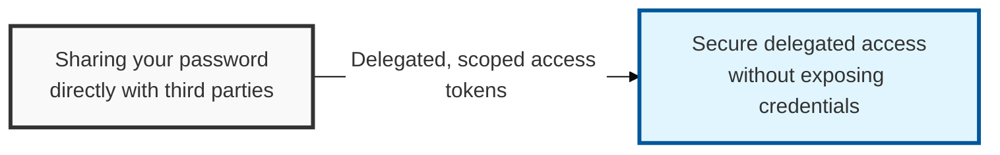

## I. Overview

**Definition**: An **open authorization framework** that lets a user securely delegate access to their own resources (data, functionality, etc.) to a third-party application (the client).

**Features**:  
( **Delegated Authorization** ) Lets a client obtain resource-access privileges securely without ever sharing the user's ID/password  
( **Easy Integration** ) Designed around **RESTful APIs**, making integration across different applications straightforward  
( **Multiple Flows** ) Supports several grant types tailored to different client environments — web, mobile, desktop, and more  
( **Security Standard** ) Standardized by the **IETF** and used as the underlying protocol for **OpenID Connect** (OIDC), extending it to support authentication as well  

## II. Mechanism & Components

### A. OAuth 2.0 Authorization Flow (Authorization Code Flow)

1. **Client request**: The user requests access to a specific resource from within the client app
2. **Redirect to authorization server**: The client redirects the user to the **Authorization Server** (including the **Client ID**, **Redirect URI**, etc.)
3. **User consent**: The user consents, at the authorization server, to delegate resource-access privileges to the client
4. **Authorization code issued**: After the user consents, the authorization server issues an **Authorization Code** to the client (delivered via the **Redirect URI**)
5. **Access token exchange**: The client presents the **Authorization Code** to the authorization server and obtains an **Access Token** and a **Refresh Token**
6. **Resource access**: The client uses the **Access Token** it obtained to call the **Resource Server**'s API

### B. OAuth 2.0 Roles

| Role | Description | Responsibility |
|:---:|----------|----------|
| **Resource Owner** | The owner of the protected resource (usually the end user) | Delegates resource-access privileges to the client |
| **Client** | The application requesting access to the protected resource | Obtains and uses an **Access Token** with the user's consent |
| **Authorization Server** | Authenticates the user and issues an **Access Token** to the client | Obtains the **Resource Owner**'s consent and issues or denies tokens |
| **Resource Server** | The server hosting the protected resource (API) | Verifies the **Access Token** and provides the resource to the client |

## III. Vulnerabilities & Security Measures

| Attack Vector | Primary Control |
|---|---|
| Authorization code theft / redirect URI manipulation | Strict Redirect URI allowlisting on the authorization server |
| CSRF via forged authorization requests | `state` parameter, verified on callback |
| Stolen code replay (public clients, mobile/SPA) | PKCE (Proof Key for Code Exchange) |
| Access token theft / long-lived token misuse | Short token lifetimes, HTTPS everywhere |
| Compromised authorization server / IdP | Harden the IdP itself — it is the single point of failure for every connected client |

PKCE deserves to be treated as mandatory for any public client rather than the optional add-on the spec originally scoped it as — the cost of implementing it is near zero, and it closes the authorization-code-interception attack even when a redirect URI isn't perfectly locked down. Teams that skip PKCE because "we're a confidential client with a stored secret" are betting that client-secret storage was done correctly, which is a worse bet than just adding PKCE.
