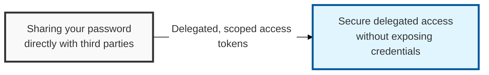

## I. Overview

**Definition**: An **open authorization framework** that lets a user securely delegate access to their own resources (data, functionality, etc.) to a third-party application (the client).

**Features**:  
( **Delegated Authorization** ) Lets a client obtain resource-access privileges securely without ever sharing the user's ID/password  
( **Easy Integration** ) Designed around **RESTful APIs**, making integration across different applications straightforward  
( **Multiple Flows** ) Supports several grant types tailored to different client environments — web, mobile, desktop, and more  
( **Security Standard** ) Standardized by the **IETF** and used as the underlying protocol for **OpenID Connect** (OIDC), extending it to support authentication as well  

## II. Mechanism & Components

### A. OAuth 2.0 Authorization Flow (Authorization Code Flow)

1. **Client request**: The user requests access to a specific resource from within the client app
2. **Redirect to authorization server**: The client redirects the user to the **Authorization Server** (including the **Client ID**, **Redirect URI**, etc.)
3. **User consent**: The user consents, at the authorization server, to delegate resource-access privileges to the client
4. **Authorization code issued**: After the user consents, the authorization server issues an **Authorization Code** to the client (delivered via the **Redirect URI**)
5. **Access token exchange**: The client presents the **Authorization Code** to the authorization server and obtains an **Access Token** and a **Refresh Token**
6. **Resource access**: The client uses the **Access Token** it obtained to call the **Resource Server**'s API

### B. OAuth 2.0 Roles

| Role | Description | Responsibility |
|:---:|----------|----------|
| **Resource Owner** | The owner of the protected resource (usually the end user) | Delegates resource-access privileges to the client |
| **Client** | The application requesting access to the protected resource | Obtains and uses an **Access Token** with the user's consent |
| **Authorization Server** | Authenticates the user and issues an **Access Token** to the client | Obtains the **Resource Owner**'s consent and issues or denies tokens |
| **Resource Server** | The server hosting the protected resource (API) | Verifies the **Access Token** and provides the resource to the client |

## III. Advanced Topics & Comparison

### A. OAuth 2.0 Security Threats

- **Authorization code theft**: Manipulating the **Redirect URI** or exploiting a client vulnerability to steal the authorization code and obtain a token
- **Access token theft**: Unauthorized resource access following a token leak from the client app or the transport channel
- **Redirect URI tampering**: An attacker steals the client's registration information and changes the redirect address to a malicious site
- **Weak authorization server**: A vulnerability in the **IdP** itself puts every connected client and resource at risk

### B. OAuth 2.0 Security Hardening

- **Redirect URI validation**: The authorization server should process a callback only if it matches a registered **Redirect URI**
- **Use of the state parameter**: Pass a **state** value with the authorization request and verify it on callback to prevent CSRF attacks
- **PKCE (Proof Key for Code Exchange)**: Prevents token issuance after a stolen code (mainly applied to public clients and mobile apps)
- **Short access-token lifetimes**: Setting a short validity period limits the damage if a token is stolen
- **Use HTTPS**: Apply **HTTPS** on every communication channel to encrypt data in transit

> **Key Point**: OAuth 2.0 is the standard for delegated authorization, and it depends on the secure issuance, transmission, and verification of the **Access Token**, together with strong security management by the **IdP**.
