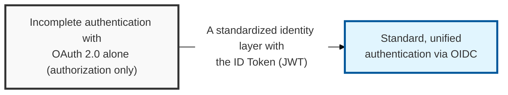
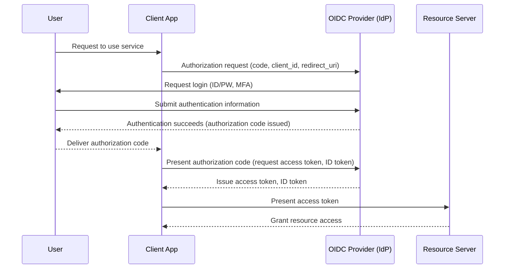

## I. Overview

**Definition**: An **OpenID**-based authentication protocol, built on top of **OAuth 2.0**, for securely sharing a user's authentication information with a mutually trusted service (**SP**).

**Features**:  
( **Simplified SSO** ) Gives users a unified login experience across multiple services while easing the account-management burden on IT administrators  
( **Standardized Identity Information** ) Delivers consistent user profile information (name, email, profile photo, etc.) through a **JWT**-based **ID Token**  
( **Compatibility** ) Being built on **OAuth 2.0**, it can be applied easily across web, mobile, desktop, and other client environments  
( **Authentication Plus Authorization** ) **OAuth 2.0** focuses on granting authorization; OIDC adds authentication on top, supporting user identification and SSO  

## II. Mechanism & Components

### A. OIDC Authentication Flow (Authorization Code Flow)

### B. Key Components of OIDC

| Component | Description | Role |
|:---:|----------|----------|
| **End-User** | The end user trying to use the service | Provides identity information and consents to access |
| **Client** | The application requesting resource access on the user's behalf | Obtains and uses the **Authorization Code** / **ID Token** / **Access Token** |
| **Authorization Server (IdP)** | Authenticates the user and issues the **Access Token** and **ID Token** | Handles **End-User** authentication and authorization |
| **Resource Server** | The server hosting the protected resource (API) | Verifies the **Access Token** and provides the resource to the client |
| **ID Token** | A **JWT** (JSON Web Token) carrying the user's authentication information | Confirms the user's identity and supplies basic profile information |

## III. Advanced Topics & Comparison

### A. OIDC Security Vulnerabilities

- **ID Token/Access Token theft**: Risk of account takeover if a token leaks due to a client vulnerability or a lack of **HTTPS**
- **Weak Redirect URI validation**: Processing a callback outside the registered **Redirect URI** exposes the flow to attack
- **No state parameter**: Vulnerable to CSRF attacks that can trigger malicious redirects
- **IdP-level vulnerabilities**: If the **IdP**'s own security is weak, every connected service becomes vulnerable

### B. OIDC Security Hardening

- **Enforce HTTPS**: Use **HTTPS** on every communication channel to encrypt data in transit
- **Redirect URI allowlisting**: Allow only the **Redirect URI**s registered with the **IdP**, preventing callback-address tampering
- **Use the state parameter**: Generate a unique **state** value on each authentication request and verify it on callback to defend against CSRF
- **PKCE (Proof Key for Code Exchange)**: Prevents token issuance after a stolen code — especially important for public clients and mobile apps
- **ID Token verification**: Verify the **JWT** signature, expiration (**exp**), issuer (**iss**), audience (**aud**), and other required claims

> **Key Point**: Because OIDC extends **OAuth 2.0** to add user authentication, the secure issuance, transmission, and verification of the **ID Token**, together with strong **IdP** security, are essential.
