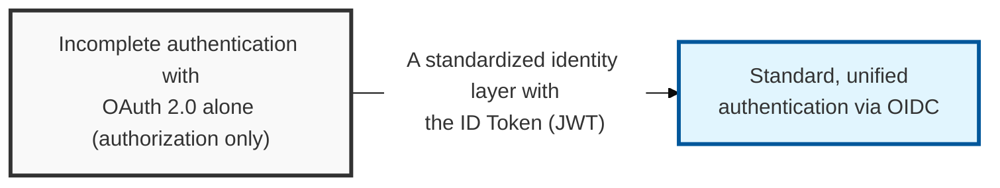
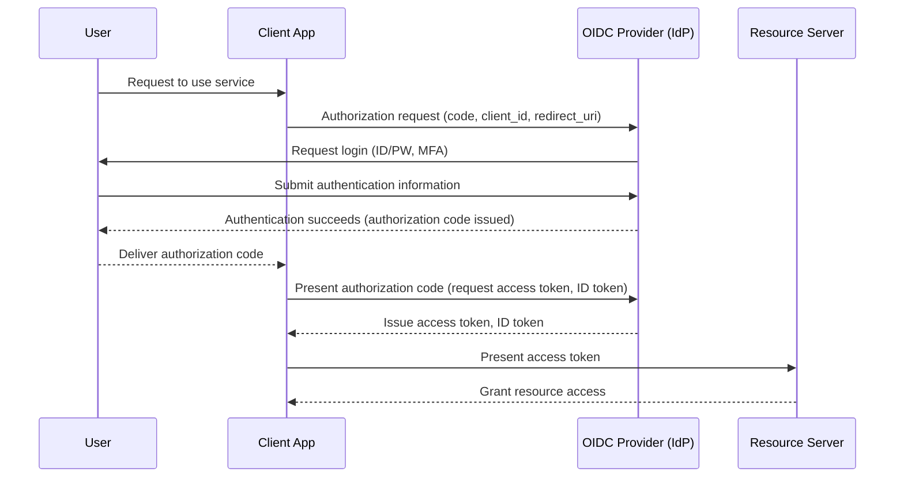

## I. Overview

**Definition**: An **OpenID**-based authentication protocol, built on top of **OAuth 2.0**, for securely sharing a user's authentication information with a mutually trusted service (**SP**).

**Features**:  
( **Simplified SSO** ) Gives users a unified login experience across multiple services while easing the account-management burden on IT administrators  
( **Standardized Identity Information** ) Delivers consistent user profile information (name, email, profile photo, etc.) through a **JWT**-based **ID Token**  
( **Compatibility** ) Being built on **OAuth 2.0**, it can be applied easily across web, mobile, desktop, and other client environments  
( **Authentication Plus Authorization** ) **OAuth 2.0** focuses on granting authorization; OIDC adds authentication on top, supporting user identification and SSO  

## II. Mechanism & Components

### A. OIDC Authentication Flow (Authorization Code Flow)

### B. Key Components of OIDC

| Component | Description | Role |
|:---:|----------|----------|
| **End-User** | The end user trying to use the service | Provides identity information and consents to access |
| **Client** | The application requesting resource access on the user's behalf | Obtains and uses the **Authorization Code** / **ID Token** / **Access Token** |
| **Authorization Server (IdP)** | Authenticates the user and issues the **Access Token** and **ID Token** | Handles **End-User** authentication and authorization |
| **Resource Server** | The server hosting the protected resource (API) | Verifies the **Access Token** and provides the resource to the client |
| **ID Token** | A **JWT** (JSON Web Token) carrying the user's authentication information | Confirms the user's identity and supplies basic profile information |

## III. Vulnerabilities & Security Measures

| Attack Vector | Primary Control |
|---|---|
| ID Token / access token theft | Enforce HTTPS on every channel; short token lifetimes |
| Redirect URI manipulation | Allowlist only registered Redirect URIs at the IdP |
| CSRF via forged authentication requests | Unique `state` parameter per request, verified on callback |
| Stolen authorization code replay | PKCE, especially for public/mobile clients |
| Forged or unverified ID Token | Verify signature, `exp`, `iss`, and `aud` on every ID Token — never trust an unverified claim |

The ID Token is where most OIDC integration bugs actually live, because it's trivial to decode the JWT and read its claims without ever validating the signature, issuer, or audience — a token that decodes cleanly is not the same as a token that has been verified. Treat "did we call the JWT verification library, not just the JWT parsing library" as a mandatory review question for any OIDC client integration, since the two are easy to confuse and only one of them is actually secure.
