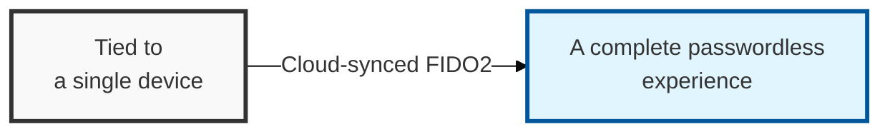
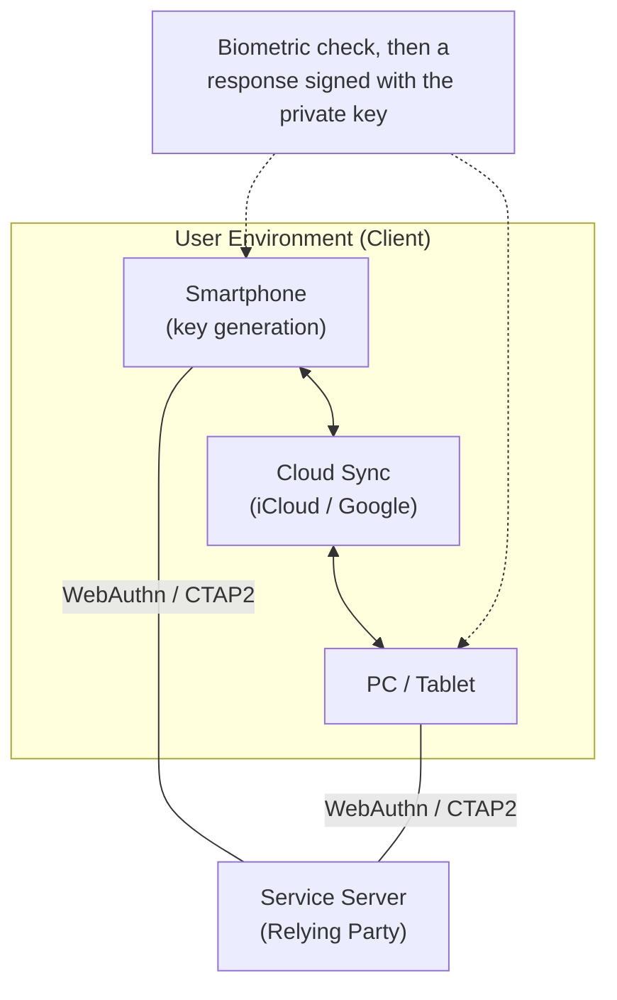

## I. Overview

**Definition**: A passkey is a FIDO2-based credential that syncs across a user's devices via the cloud, completing the shift to a fully passwordless authentication experience.

**Features**:  
( **Passwordless** ) Eliminates passwords, which are hard to remember and easy to steal, fundamentally strengthening the authentication process  
( **Multi-Device Sync** ) Cloud-based credential sync provides continuity across a device change with no re-registration required  
( **Phishing Cut Off at the Source** ) Domain-binding technology automatically and technically rejects authentication requests from fake sites  

## II. Mechanism & Components

### A. Passkey Authentication Structure and Sync Process

- **Sync**: A generated passkey is automatically copied to the user's other devices on the same account via services like iCloud or Google Password Manager
- **Authentication**: The device signs the server's challenge with its private key and responds; the actual biometric data or password is never sent to the server

### B. Key Technical Elements of Passkeys

| Technical Element | Details | Note |
|:---:|----------|----------|
| **WebAuthn** | A standard API for performing FIDO authentication in a web browser | W3C standard |
| **CTAP2** | A communication protocol between an external authenticator (e.g., a smartphone) and a platform | Cross-device linkage |
| **End-to-End Encryption** | Encrypts credentials when syncing via the cloud | Not even the cloud provider can read them |
| **Multi-Device FIDO** | A credential created on one device can be used on other devices | The key differentiator of passkeys |

## III. Outlook & Future Direction

| Approach | Status | Direction |
|---|---|---|
| Password (knowledge-based) | Standard practice | Being displaced for new deployments |
| Traditional FIDO (device-bound) | Mature, but limited by device-tied credentials | Largely absorbed into the passkey model |
| Passkey (synced FIDO2/WebAuthn) | Growing platform support (Apple, Google, Microsoft) | Default for consumer-facing sign-in |

Passkeys are clearing the adoption barrier that killed earlier passwordless attempts: platform-level support built into every major OS means users don't need to install anything or manage a separate hardware key, which is exactly the step every prior passwordless push — including early FIDO U2F — stalled on. Expect password-as-primary-auth to become the legacy fallback option within a few years for consumer products; enterprise adoption will lag given legacy IdP and device-management dependencies, but the direction is not in question.
