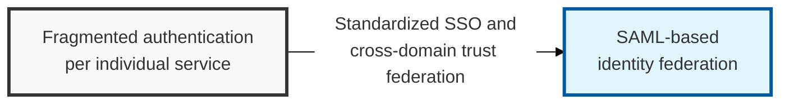
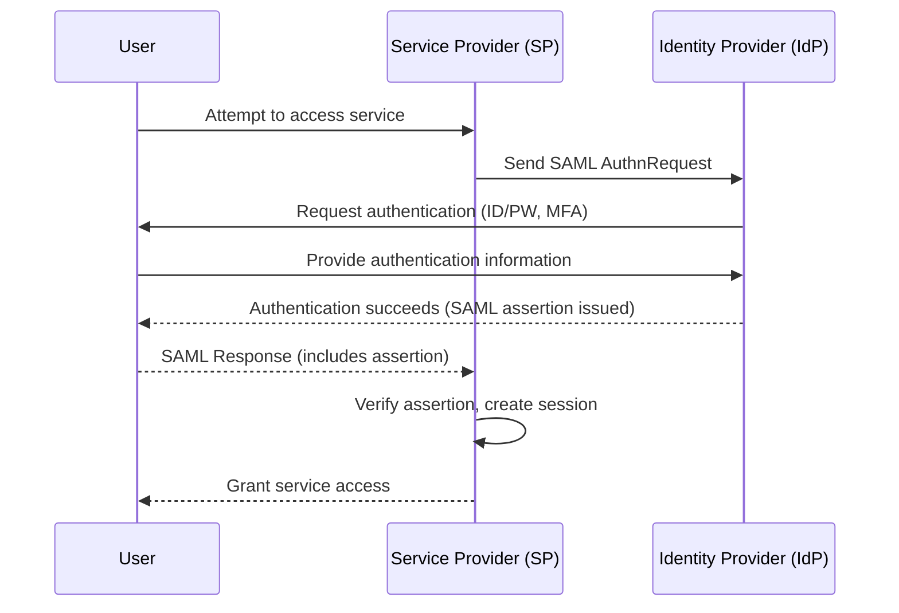

## I. Overview

**Definition**: An **XML**-based open standard protocol for securely exchanging user authentication information in web-based distributed environments.

**Features**:  
( **XML-Based** ) Represents a user's identity, attributes, and privileges as an **XML**-formatted assertion for exchange  
( **Web SSO Standard** ) **SAML 2.0** has become the de facto standard for implementing **SSO** (Single Sign-On) in browser-based environments  
( **Federated Identity** ) Establishes a trust relationship between an **IdP** and an **SP** in different security domains, enabling them to share user authentication information  
( **Industry Standard** ) Standardized under the leadership of **OASIS** (Organization for the Advancement of Structured Information Standards)  

## II. Mechanism & Components

### A. SAML 2.0-Based SSO Flow (SP-Initiated)

### B. SAML Message Components

| Component | Description | Security Value |
|----------|----------|----------|
| **SAML Assertion** | An **XML** document carrying the user's identity, attributes, and authentication/authorization information | The core artifact exchanged for user authentication |
| **SAML Authority** | The **IdP** (identity authority) or the **SP** (service provider) | Performs the authentication or authorization role |
| **SAML Binding** | The transport mechanism for **SAML** messages, e.g. **HTTP POST**, **HTTP Redirect** | Defines the message-delivery channel |
| **SAML Metadata** | Meta information exchanged to establish trust between **IdP** and **SP** | Supports interoperability and secure configuration |

## III. Advanced Topics & Comparison

### A. SAML Security Vulnerabilities

- **Assertion forgery / replay**: Insufficient signature verification on a **SAML Assertion** allows access attempts with forged information
- **Client-side attacks**: **XSS** and similar techniques can steal and replay a user's SAML request/response (**session hijacking**)
- **IdP/SP misconfiguration**: Exploiting mistakes such as incorrect metadata exchange or a weak signature algorithm

### B. SAML Security Hardening

- **Strong signing and encryption**: Sign and encrypt **SAML Assertions** and **Metadata** to guarantee integrity and confidentiality
- **Secure metadata exchange between IdP/SP**: Use **HTTPS** when exchanging **Metadata**, and periodically re-verify trust
- **Time synchronization**: Keep **IdP** and **SP** clocks precisely synchronized via **NTP** to prevent replay attacks
- **Least privilege**: When the **SP** verifies a **SAML Assertion**, extract only the attributes it actually needs

> **Key Point**: Because **SAML** has a complex **XML**-based structure, using a standard implementation library and rigorously establishing trust and verifying metadata between **IdP** and **SP** are both critical.
