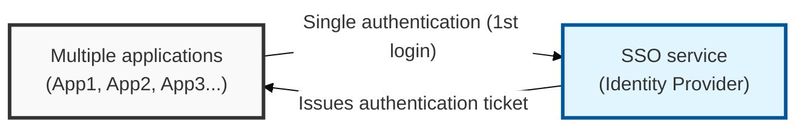
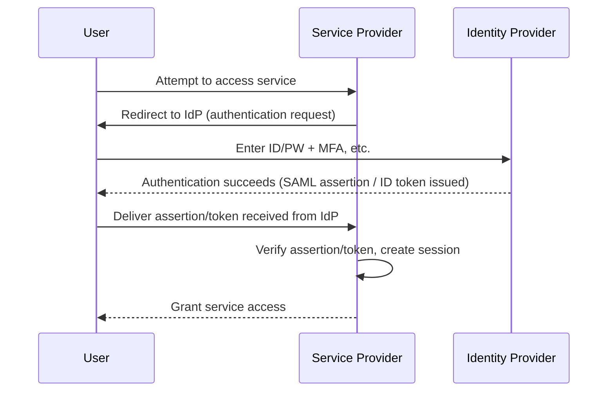

## I. Overview

**Definition**: An authentication method that lets a user log into multiple applications and services using a single **ID** and password.

**Features**:  
( **Greater User Convenience** ) Eliminates repeated login steps, significantly improving the user experience and boosting productivity  
( **Stronger Security** ) Reduces the burden of managing complex passwords and makes it easier to apply strong, centralized authentication such as **MFA**  
( **Management Efficiency** ) Centralizes account creation, deletion, and privilege management, reducing the overall IT administration burden  
( **Improved Accessibility** ) Delivers a consistent user experience across mobile devices and other device environments  

## II. Mechanism & Components

### A. SSO Authentication Flow (Federated Identity)

### B. Major Protocols Used to Implement SSO

| Protocol | Key Characteristics | How It Works |
|:---:|----------|----------|
| **SAML (Security Assertion Markup Language)** | An **XML**-based standard, mainly used for web-based service integration | User accesses **SP** → redirected to **IdP** → **IdP** authenticates and issues a **SAML Assertion** → **SP** verifies the assertion and grants access |
| **OAuth 2.0** | An authorization protocol used to delegate resource-access privileges | User delegates access to **SP**'s resources to the **IdP** → **IdP** issues an **Access Token** → **SP** verifies the token and grants resource access |
| **OpenID Connect (OIDC)** | An identity layer built on **OAuth 2.0** that supplies user authentication information (ID Token) | Adds an **ID Token** (user info) on top of the **OAuth 2.0** flow → **SP** verifies the ID Token and identifies the user |

## III. Advanced Topics & Comparison

### A. Potential Vulnerabilities in SSO Systems

- **Centralized single point of failure**: If the **IdP** goes down, every connected service becomes inaccessible
- **IdP account takeover**: If **IdP** credentials leak, every connected service account is put at risk
- **Session hijacking**: A stolen **SSO** session token allows unauthorized access to services

### B. SSO Security Hardening

- **Strong IdP authentication**: Apply **MFA**, a strict password policy, and **SSO** session timeouts
- **Protocol security**: Require **HTTPS**; verify the signature and encryption of **SAML/OIDC** assertions and tokens
- **Stronger session management**: Apply web security measures such as **HttpOnly**, **Secure** attributes, and **CSRF** tokens
- **Regular auditing and monitoring**: Analyze **IdP** and connected-service access logs and detect abnormal behavior

> **Key Point**: **SSO** improves user convenience, but because the **IdP** itself can become the focal point of an attack, hardening the **IdP** and rigorously managing every connected service are both essential.
