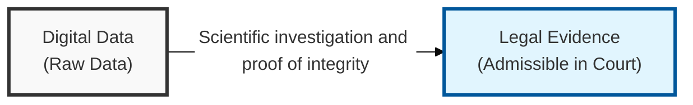
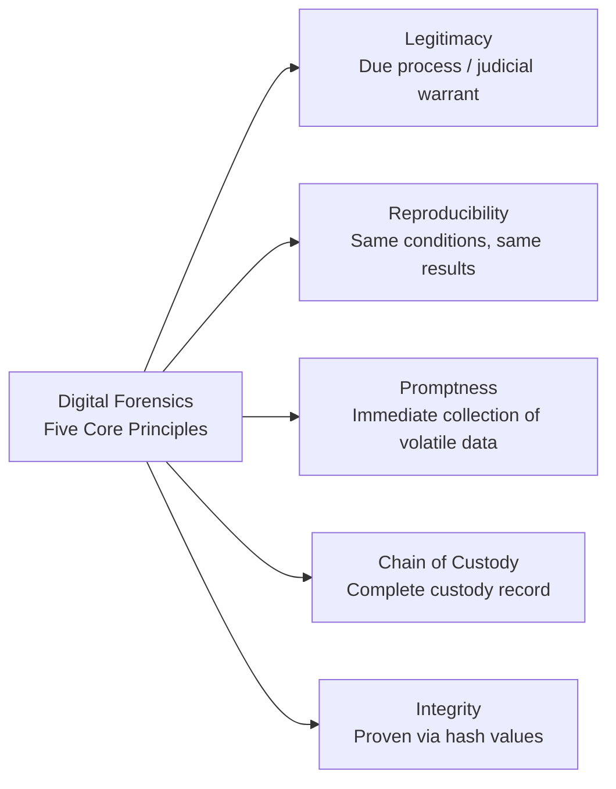

## I. Overview

**Definition**: A scientific investigation and examination technique that collects, recovers, and analyzes electronic data stored on digital devices such as computers, smartphones, and cloud services in order to use it as legal evidence.

**Features**:  
( **Integrity** ) Proves through means such as hash ( **Hash** ) values that collected evidence has not been altered or forged during the analysis process  
( **Chain of Custody** ) **Chain of Custody**: maintains a record of every path and person responsible, from evidence collection through submission to the court  
( **Reproducibility** ) Ensures the objectivity that analyzing with the same tools and procedures must yield the same results  
( **Legitimacy** ) Preserves the legal admissibility ( **Admissibility** ) of evidence by complying with due process and the principle of judicial warrants  

## II. Mechanism & Components

The five-step process for carrying out a digital forensic investigation while preserving the evidentiary value of the evidence is as follows.

| Step | Key Activities | Core Techniques & Tools |
|:---:|---|---|
| 1. Evidence Preparation | Assemble the response team, inspect equipment | Forensic workstation, evidence bags |
| 2. Evidence Collection | Imaging, duplication | Write blocker (write-protection device), EnCase |
| 3. Evidence Transport | Sealing, maintaining chain of custody | Evidence bags, transport log management |
| 4. Evidence Analysis | Recovery of deleted files, timeline analysis | Data carving, slack space analysis |
| 5. Report Writing | Objective recording of facts, testimony preparation | Analysis report, expert opinion |

## III. Advanced Topics & Comparison

| Category | Details |
|---|---|
| Anti-Forensics Techniques | Data encryption, steganography, and complete data wiping |
| Countermeasures | Password cracking and recovering decryption keys through memory forensics (live response) |
