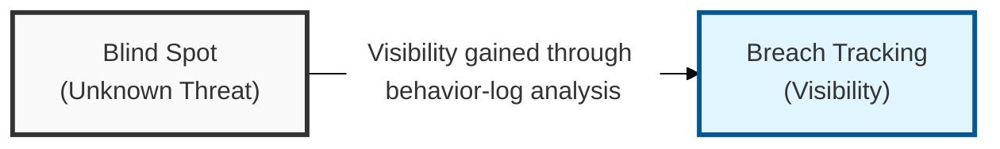
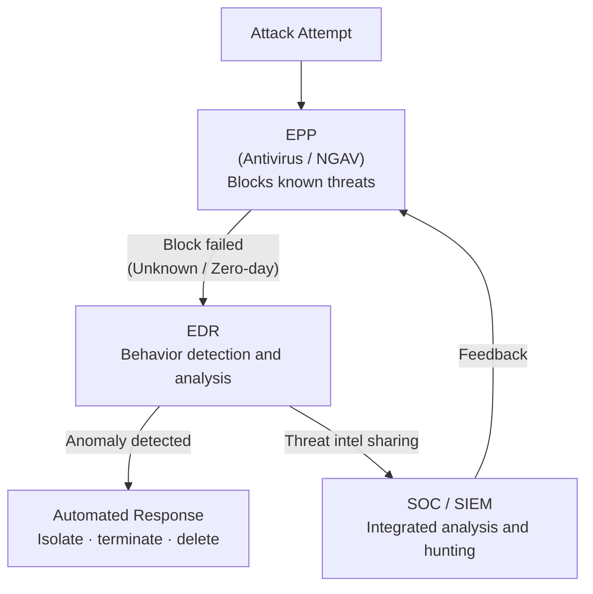

## I. Overview

**Definition**: A security platform that continuously monitors and records activity occurring on an endpoint, such as processes, files, network connections, and registry changes, in order to detect and respond to unknown threats.

**Features**:  
( **Visibility** ) Under the assumption that "the breach has already happened" ( **Assume Breach** ), records a full timeline of all activity on the endpoint  
( **Active Response** ) When a threat is detected in real time, immediately isolates the endpoint and terminates the process to block the damage from spreading  
( **Threat Hunting** ) Proactively traces potential attack traces by mapping activity against the **MITRE ATT&CK** framework  

## II. Mechanism & Components

EDR operates as the second layer behind an EPP (antivirus / NGAV), stepping in whenever a threat slips past initial prevention. Its core functions are as follows.

| Function | Description | Security Value |
|---|---|---|
| Continuous Monitoring | Collects and records real-time event logs | Enables timeline analysis of activity before and after an attack |
| Behavior-Based Detection | Detects unknown threats (zero-day) and anomalous behavior | Blocks signature-less, variant malware |
| Threat Hunting | Proactively traces potential threats via mapping to frameworks such as MITRE ATT&CK | Enables proactive threat identification and closes security blind spots |
| Incident Response | Network isolation, process termination, file deletion, and similar actions | Prevents damage from spreading and supports rapid recovery |

## III. Comparison & Application

| Comparison Item | EPP (Endpoint Protection Platform) | EDR (Endpoint Detection & Response) |
|---|---|---|
| Primary Purpose | Blocking known attacks (Prevention) | Detecting and responding to threats that have already penetrated (Detection) |
| Basis for Judgment | File patterns (Signature), static analysis | Dynamic behavior and context analysis |
| Core Question | "Is this file safe?" | "Why is this process modifying this file?" |
| Visibility | Low (focused mainly on block/allow decisions) | Very high (traces the attacker's entry path) |
| Relationship | First line of defense (filtering) | Second-layer visibility and response platform (tracing) |

Deploying EDR without a strong EPP still running beneath it is the mistake to watch for — teams excited about behavioral detection sometimes treat EDR as a full replacement, but that just burns the analyst's detection budget re-flagging commodity malware a signature engine would have blocked for free. Keep EPP as the first-line filter and reserve EDR's visibility for the traffic that genuinely needs human judgment.
