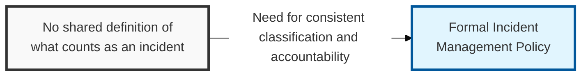
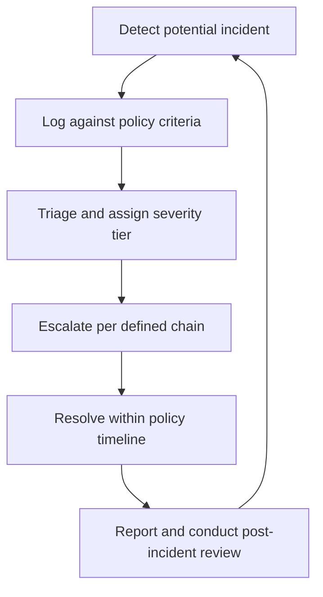

## I. Overview

**Definition**: The Incident Management Policy is the top-level governance document that defines what qualifies as an incident, establishes severity tiers, assigns accountability, and sets mandatory response and notification timelines.

**Features**:  
( **Ownership** ) Owned by the CISO's office for security incidents, in coordination with HR and facilities leadership for physical and personnel incidents.  
( **Approval** ) Approved by executive management or the board before it takes effect.  
( **Consistency** ) Without it, incident classification and escalation become inconsistent and response times unpredictable.  
( **Regulatory Compliance** ) Prevents missed regulatory notification deadlines, such as breach disclosure laws.

## II. Structure & Process

| Field | Description |
|---|---|
| Incident Definition | Criteria that distinguish an incident from a routine service event or minor issue |
| Severity Tiers | Classification levels (e.g. **Critical**, **High**, **Medium**, **Low**) with defined business-impact thresholds |
| Roles & Responsibilities | Named roles — incident commander, SOC analyst, HR/facilities liaison, communications lead |
| Notification Timelines | Maximum time allowed to notify internal stakeholders, regulators, or affected parties per severity |
| Escalation Path | Chain of authority for escalating unresolved or high-severity incidents |
| Scope | Categories covered: security, IT operations, physical safety, HR/personnel |
| Review Cadence | Frequency of policy review and re-approval by executive sponsors |
| Enforcement | Consequences for non-compliance with reporting or response obligations |

The policy is reviewed at least annually or after any incident that exposes a gap in classification, escalation, or notification requirements.

## III. Expected Benefits & Implications

| Benefit | Where It Shows Up |
|---|---|
| Consistent severity classification | Cross-incident metrics become comparable instead of anecdotal |
| Predictable escalation | Executives and regulators are notified inside the window, not after the fact |
| Audit-ready governance | Compliance reviews cite the policy directly instead of reconstructing intent after an incident |

The real payoff of a written policy shows up in the incidents it prevents from getting worse, not the ones it handles cleanly — a severity tier that's ambiguous on paper gets resolved under pressure by whoever is loudest in the room, and that's exactly the moment a regulator-facing notification deadline gets missed. Treat the annual review less as a compliance ritual and more as the one guaranteed chance to close a gap the last incident exposed, before the next one finds it first.

Related: [Incident Management Process](../incident-management-process/), [Major Incident Report Template](../major-incident-report-template/)
