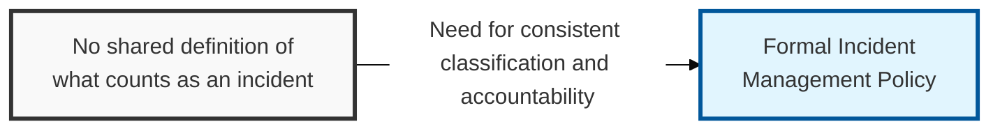
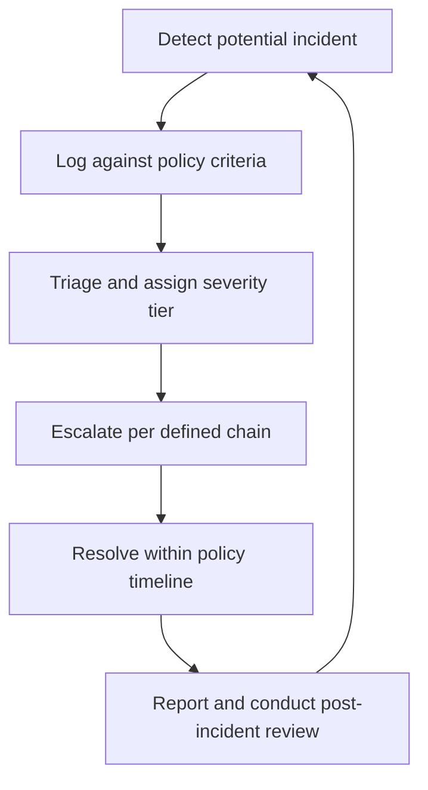

## I. Overview

**Definition**: The Incident Management Policy is the top-level governance document that defines what qualifies as an incident, establishes severity tiers, assigns accountability, and sets mandatory response and notification timelines.

**Features**:  
( **Ownership** ) Owned by the CISO's office for security incidents, in coordination with HR and facilities leadership for physical and personnel incidents.  
( **Approval** ) Approved by executive management or the board before it takes effect.  
( **Consistency** ) Without it, incident classification and escalation become inconsistent and response times unpredictable.  
( **Regulatory Compliance** ) Prevents missed regulatory notification deadlines, such as breach disclosure laws.

## II. Structure & Process

| Field | Description |
|---|---|
| Incident Definition | Criteria that distinguish an incident from a routine service event or minor issue |
| Severity Tiers | Classification levels (e.g. **Critical**, **High**, **Medium**, **Low**) with defined business-impact thresholds |
| Roles & Responsibilities | Named roles — incident commander, SOC analyst, HR/facilities liaison, communications lead |
| Notification Timelines | Maximum time allowed to notify internal stakeholders, regulators, or affected parties per severity |
| Escalation Path | Chain of authority for escalating unresolved or high-severity incidents |
| Scope | Categories covered: security, IT operations, physical safety, HR/personnel |
| Review Cadence | Frequency of policy review and re-approval by executive sponsors |
| Enforcement | Consequences for non-compliance with reporting or response obligations |

The policy is reviewed at least annually or after any incident that exposes a gap in classification, escalation, or notification requirements.

## III. Best Practices & Comparison

| Document | Primary Purpose | Trigger | Owner |
|---|---|---|---|
| Incident Management Policy | Define what an incident is and set governance rules | Annual review or major incident finding | CISO / Executive Management |
| [Incident Management Process](../incident-management-process/) | Operational step-by-step handling procedure | Any active incident | SOC / IR Team |
| [Major Incident Report Template](../major-incident-report-template/) | Document a specific high-severity security incident | A critical or high-severity event occurs | SOC / IR Team |

- Define severity tiers in business-impact terms, not just technical terms, so non-technical stakeholders can classify correctly.
- Align notification timelines with applicable regulatory deadlines (breach laws, contractual SLAs).
- Keep the policy short and principle-based; put step-by-step detail in the companion process document.
- Require executive sign-off on any change to severity thresholds or escalation authority.
- Revisit the policy after every major incident post-mortem, not only on a fixed calendar.

Related: [Incident Management Process](../incident-management-process/), [Major Incident Report Template](../major-incident-report-template/)
