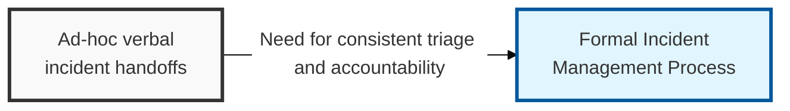
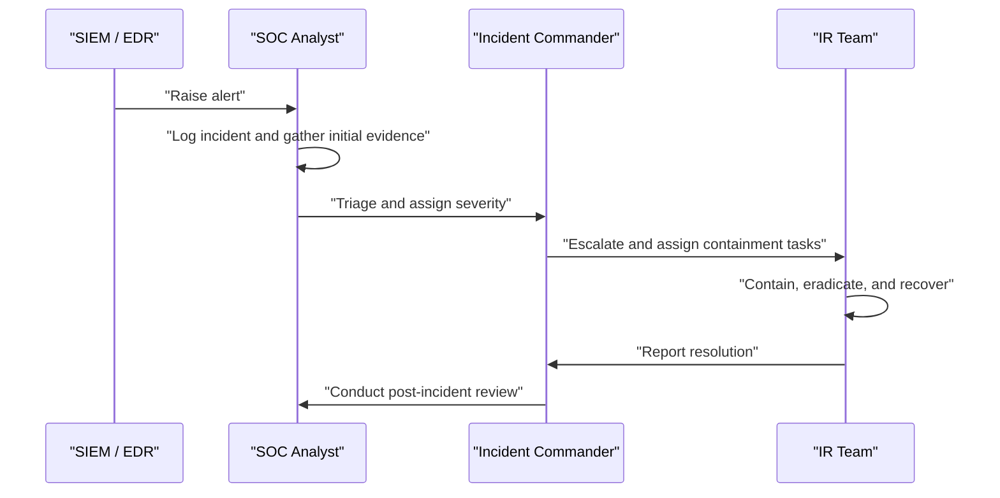

## I. Overview

**Definition**: The Incident Management Process is the operational runbook that translates the Incident Management Policy into concrete, repeatable steps: how an event is detected, logged, triaged, escalated, contained, and closed out.

**Features**:  
( **Ownership** ) Owned and executed by the SOC / incident response team.  
( **Telemetry** ) SIEM and EDR platforms provide the detection and telemetry that feed the process.  
( **Consistency** ) Replaces inconsistent, memory-based handling that extends dwell time and loses forensic evidence.  
( **Audit Readiness** ) Produces incident records detailed enough to support root-cause analysis and compliance audits.

## II. Structure & Process

| Field | Description |
|---|---|
| Detection Source | Origin of the alert, e.g. **SIEM** correlation rule, **EDR** behavioral alert, user report |
| Incident ID | Unique tracking number assigned at logging for chain-of-custody and reporting |
| Severity Level | Tier assigned during triage per the governing policy |
| Assigned Responder | Analyst or incident commander responsible for the response |
| Containment Action | Immediate step taken to limit spread (isolate host, disable account, block IP) |
| Timeline | Timestamped sequence of detection, triage, containment, and resolution events |
| Root Cause | Underlying technical or process failure identified during investigation |
| Corrective Action | Follow-up remediation or control change to prevent recurrence |

Every incident record is closed only after root cause and corrective actions are documented, and high-severity incidents proceed to a formal post-incident review meeting.

## III. Adoption Considerations

| Risk | Primary Control |
|---|---|
| Volatile evidence lost during containment | Capture memory / session state before isolating or rebuilding a host |
| Inconsistent handling outside the process | Single intake queue for every incident, no informal side-channel triage |
| Corrective actions never close the loop | Feed root-cause findings back into SIEM/EDR detection rules, not just the retro notes |

The step teams skip under pressure is almost always evidence preservation before containment — isolating a compromised host feels like the responsible move in the moment, but it also destroys the memory-resident indicators that would have explained how the attacker got in. Build "capture before contain" into the runbook itself rather than leaving it to responder judgment, because judgment is exactly what's compromised at 2 a.m. during a live incident.

Related: [Incident Management Policy](../incident-management-policy/), [Major Incident Report Template](../major-incident-report-template/)
