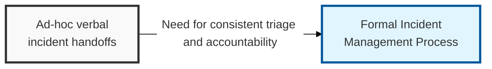
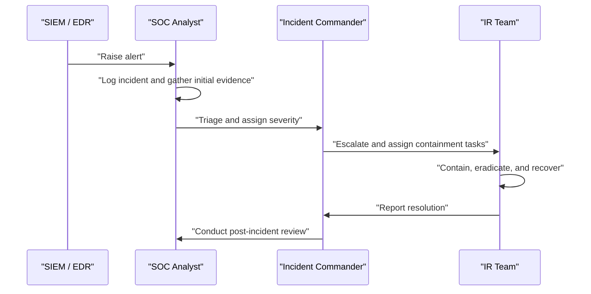

## I. Overview

**Definition**: The Incident Management Process is the operational runbook that translates the Incident Management Policy into concrete, repeatable steps: how an event is detected, logged, triaged, escalated, contained, and closed out.

**Features**:  
( **Ownership** ) Owned and executed by the SOC / incident response team.  
( **Telemetry** ) SIEM and EDR platforms provide the detection and telemetry that feed the process.  
( **Consistency** ) Replaces inconsistent, memory-based handling that extends dwell time and loses forensic evidence.  
( **Audit Readiness** ) Produces incident records detailed enough to support root-cause analysis and compliance audits.

## II. Structure & Process

| Field | Description |
|---|---|
| Detection Source | Origin of the alert, e.g. **SIEM** correlation rule, **EDR** behavioral alert, user report |
| Incident ID | Unique tracking number assigned at logging for chain-of-custody and reporting |
| Severity Level | Tier assigned during triage per the governing policy |
| Assigned Responder | Analyst or incident commander responsible for the response |
| Containment Action | Immediate step taken to limit spread (isolate host, disable account, block IP) |
| Timeline | Timestamped sequence of detection, triage, containment, and resolution events |
| Root Cause | Underlying technical or process failure identified during investigation |
| Corrective Action | Follow-up remediation or control change to prevent recurrence |

Every incident record is closed only after root cause and corrective actions are documented, and high-severity incidents proceed to a formal post-incident review meeting.

## III. Best Practices & Comparison

| Document | Primary Purpose | Trigger | Owner |
|---|---|---|---|
| Incident Management Process | Step-by-step operational handling of any incident | Any detected event | SOC / IR Team |
| [Incident Management Policy](../incident-management-policy/) | Governance rules and definitions behind the process | Annual review or policy gap | CISO / Executive Management |
| [Major Incident Report Template](../major-incident-report-template/) | Detailed record of a single high-severity incident | Critical or high-severity event | SOC / IR Team |

- Preserve volatile evidence (memory, session state, logs) before containment actions destroy it.
- Maintain a timestamped timeline in real time rather than reconstructing it after the fact.
- Route every incident through the same intake queue so nothing is triaged informally outside the process.
- Hold a blameless post-incident review for every medium-or-higher severity incident.
- Feed corrective actions back into detection rules (SIEM/EDR) to close the loop on recurring root causes.

Related: [Incident Management Policy](../incident-management-policy/), [Major Incident Report Template](../major-incident-report-template/)
