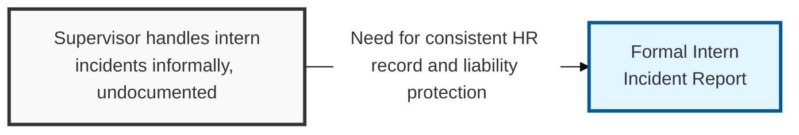
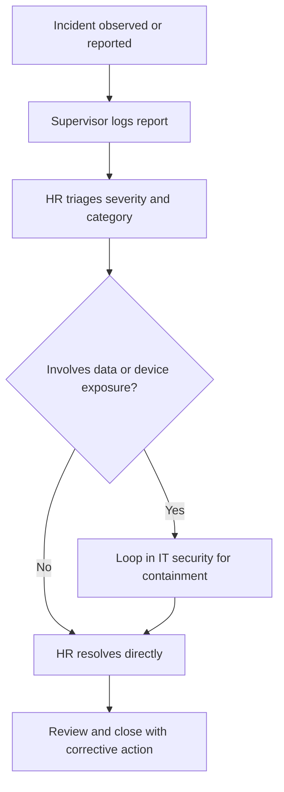

## I. Overview

**Definition**: The Intern Incident Report is a structured template for documenting any incident involving an intern or temporary staff member — policy violations, safety events, conduct issues, or accidental data exposure.

**Features**:  
( **Ownership** ) Owned by HR, typically in coordination with the intern's direct supervisor.  
( **IT Security Involvement** ) IT security is looped in wherever the incident touches systems or data.  
( **Scope** ) Covers interns, who often sit outside standard onboarding and access-control assumptions.  
( **Liability Protection** ) Unrecorded incidents involving temporary staff create liability exposure and gaps in the intern program's safety record.

## II. Structure & Process

| Field | Description |
|---|---|
| Intern Name & Program | Identity of the intern and the department or program they are assigned to |
| Supervisor | Name of the direct supervisor or program manager |
| Date & Location | When and where the incident occurred |
| Incident Type | Category, e.g. safety, conduct, policy violation, data/device exposure |
| Description | Objective, factual account of what happened |
| Witnesses | Names of any other staff present or involved |
| Immediate Action Taken | Steps taken at the time (first aid, access revocation, verbal warning) |
| Follow-up / Corrective Action | HR decision or remediation, including any escalation to IT security |

HR logs the report within 24 hours of notification and loops in IT security immediately if the incident involves system access, a company device, or data handling.

## III. Comparison & Application

| Report Type | Use When | Owner |
|---|---|---|
| Intern Incident Report | Incident involves an intern/temporary staff member, regardless of category | HR |
| [Workplace Violence Report](../workplace-violence-report/) | Any threat or violent conduct, involving any employee including interns | HR / Security |
| [Major Incident Report Template](../major-incident-report-template/) | A security-critical event, regardless of who triggered it | SOC / IR Team |

The selection question is "what kind of incident is it," not "who was involved" — an intern who mishandles a company laptop is an Intern Incident Report, but an intern who threatens a coworker is a Workplace Violence Report first, with the intern angle noted as context rather than the primary lens. When category and population overlap, default to the report type that matches the risk (safety, security, or conduct), not the one that matches the person's job title.

Related: [Workplace Violence Report](../workplace-violence-report/), [Incident Management Process](../incident-management-process/)
