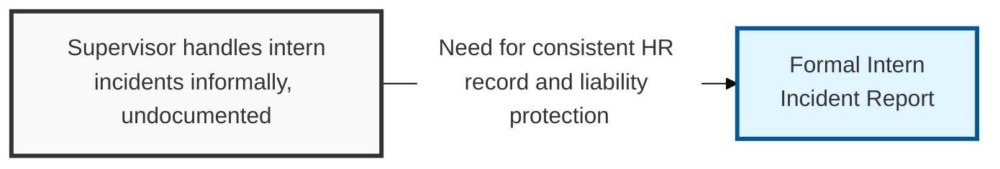
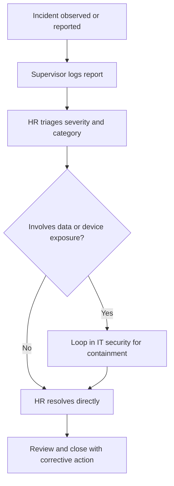

## I. Overview

**Definition**: The Intern Incident Report is a structured template for documenting any incident involving an intern or temporary staff member — policy violations, safety events, conduct issues, or accidental data exposure.

**Features**:  
( **Ownership** ) Owned by HR, typically in coordination with the intern's direct supervisor.  
( **IT Security Involvement** ) IT security is looped in wherever the incident touches systems or data.  
( **Scope** ) Covers interns, who often sit outside standard onboarding and access-control assumptions.  
( **Liability Protection** ) Unrecorded incidents involving temporary staff create liability exposure and gaps in the intern program's safety record.

## II. Structure & Process

| Field | Description |
|---|---|
| Intern Name & Program | Identity of the intern and the department or program they are assigned to |
| Supervisor | Name of the direct supervisor or program manager |
| Date & Location | When and where the incident occurred |
| Incident Type | Category, e.g. safety, conduct, policy violation, data/device exposure |
| Description | Objective, factual account of what happened |
| Witnesses | Names of any other staff present or involved |
| Immediate Action Taken | Steps taken at the time (first aid, access revocation, verbal warning) |
| Follow-up / Corrective Action | HR decision or remediation, including any escalation to IT security |

HR logs the report within 24 hours of notification and loops in IT security immediately if the incident involves system access, a company device, or data handling.

## III. Best Practices & Comparison

| Document | Primary Purpose | Trigger | Owner |
|---|---|---|---|
| Intern Incident Report | Record incidents involving interns/temporary staff | Any intern-related incident | HR |
| [Workplace Violence Report](../workplace-violence-report/) | Record threats or violence involving any employee | Threatening or violent conduct | HR / Security |
| [Major Incident Report Template](../major-incident-report-template/) | Record high-severity security incidents | Critical security event | SOC / IR Team |

- Keep the description factual and free of subjective judgment; save conclusions for the corrective-action section.
- Loop in IT security immediately whenever a company device, credential, or dataset is involved.
- Store reports in the HR system with restricted access to protect the intern's privacy.
- Track recurring incident types across cohorts to identify onboarding or supervision gaps.
- Close every report with a documented follow-up action, even if the outcome is "no action required."

Related: [Workplace Violence Report](../workplace-violence-report/), [Incident Management Process](../incident-management-process/)
