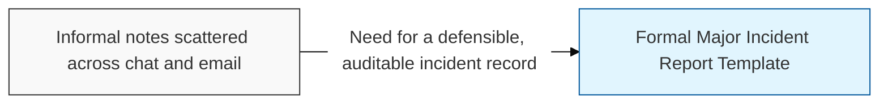
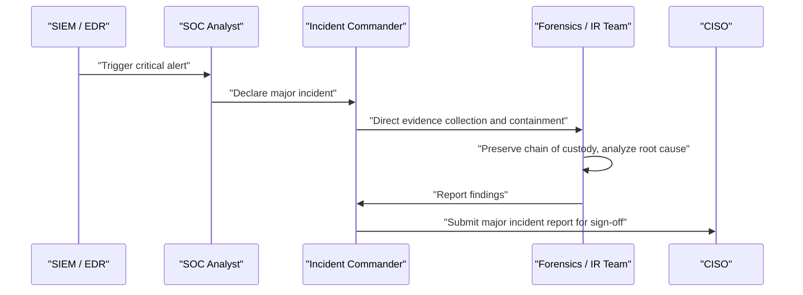

## I. Overview

The Major Incident Report Template captures the full lifecycle of a critical or high-severity security incident: detection source, impact, timeline, containment actions, root cause, and corrective actions. It is owned by the SOC / incident response team and typically requires sign-off from the incident commander and CISO before closure. Organizations need this level of detail for major incidents because regulators, auditors, and executive leadership expect a defensible, evidence-backed account of what happened, how it was detected (via **SIEM** correlation or **EDR** behavioral alerting), and what was done to prevent recurrence — informal notes are not sufficient for legal or compliance review.

## II. Structure & Process

| Field | Description |
|---|---|
| Incident ID & Severity | Unique tracking number and severity tier (**Critical**/**High**) |
| Detection Source | How the incident was found, e.g. **SIEM** alert, **EDR** detection, external report |
| Impact Summary | Systems, data, or business processes affected and estimated scope |
| Timeline | Chronological, timestamped record from first indicator to resolution |
| Containment & Eradication | Actions taken to isolate affected systems and remove the threat |
| Evidence & Chain of Custody | Forensic artifacts collected and their handling record, per digital forensics practice |
| Root Cause | Technical or procedural failure that allowed the incident |
| Corrective Actions & Owner | Remediation items with assigned owners and due dates |

Evidence collection follows chain-of-custody practice — timestamped, hashed, and logged from collection to closure — so the report can withstand legal or regulatory scrutiny.

## III. Best Practices & Comparison

| Document | Primary Purpose | Trigger | Owner |
|---|---|---|---|
| Major Incident Report Template | Document a critical/high-severity security incident in full | Critical or high-severity security event | SOC / IR Team |
| [Incident Management Process](../incident-management-process/) | General operational handling for any severity | Any detected incident | SOC / IR Team |
| [Structural Damage Incident Report](../structural-damage-incident-report/) | Document physical/facilities damage, not security-specific | Physical damage event | Facilities |

- Start the timeline the moment detection occurs; do not wait until containment to begin documentation.
- Preserve volatile evidence before remediation actions overwrite it.
- Separate factual findings from speculation; label unconfirmed hypotheses explicitly.
- Require CISO or incident commander sign-off before marking the report closed.
- Feed root-cause findings back into SIEM correlation rules and EDR detection logic to reduce recurrence.

Related: [Incident Management Process](../incident-management-process/), [Incident Management Policy](../incident-management-policy/)
