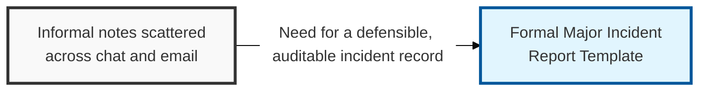

## I. Overview



**Definition**: The Major Incident Report Template captures the full lifecycle of a critical or high-severity security incident: detection source, impact, timeline, containment actions, root cause, and corrective actions.

**Features**:  
( **Ownership** ) Owned by the SOC / incident response team.  
( **Sign-Off** ) Requires sign-off from the incident commander and CISO before closure.  
( **Detection Sources** ) Documents how the incident was detected, via **SIEM** correlation or **EDR** behavioral alerting.  
( **Defensibility** ) Provides the defensible, evidence-backed account that regulators, auditors, and executive leadership expect — informal notes are not sufficient for legal or compliance review.

## II. Structure & Process

```mermaid
sequenceDiagram
    participant SIEM as "SIEM / EDR"
    participant SOC as "SOC Analyst"
    participant IC as "Incident Commander"
    participant Forensics as "Forensics / IR Team"
    participant CISO as "CISO"

    SIEM->>SOC: "Trigger critical alert"
    SOC->>IC: "Declare major incident"
    IC->>Forensics: "Direct evidence collection and containment"
    Forensics->>Forensics: "Preserve chain of custody, analyze root cause"
    Forensics->>IC: "Report findings"
    IC->>CISO: "Submit major incident report for sign-off"
```

| Field | Description |
|---|---|
| Incident ID & Severity | Unique tracking number and severity tier (**Critical**/**High**) |
| Detection Source | How the incident was found, e.g. **SIEM** alert, **EDR** detection, external report |
| Impact Summary | Systems, data, or business processes affected and estimated scope |
| Timeline | Chronological, timestamped record from first indicator to resolution |
| Containment & Eradication | Actions taken to isolate affected systems and remove the threat |
| Evidence & Chain of Custody | Forensic artifacts collected and their handling record, per digital forensics practice |
| Root Cause | Technical or procedural failure that allowed the incident |
| Corrective Actions & Owner | Remediation items with assigned owners and due dates |

Evidence collection follows chain-of-custody practice — timestamped, hashed, and logged from collection to closure — so the report can withstand legal or regulatory scrutiny.

## III. Vulnerabilities & Security Measures

| Risk | Primary Control |
|---|---|
| Evidence collected after remediation has already altered the system | Start the timeline and evidence capture at first detection, not after containment |
| Report closed without independent verification | Mandatory CISO or incident commander sign-off before closure |
| Speculation presented as root cause | Explicit separation of confirmed findings from unconfirmed hypotheses in the write-up |

Sign-off discipline matters more than the report template itself — a well-structured report that the CISO rubber-stamps without probing the root-cause finding provides no more defensibility than no report at all. The sign-off should force an actual question ("does this corrective action address the root cause, or just the symptom") rather than serve as a formality, because that's the last moment before closure when a wrong conclusion can still be caught.

Related: [Incident Management Process](../incident-management-process/), [Incident Management Policy](../incident-management-policy/)
