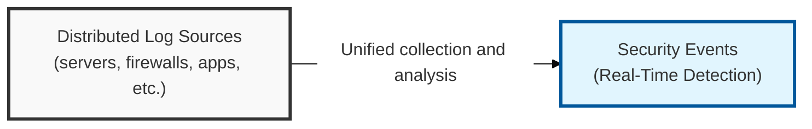
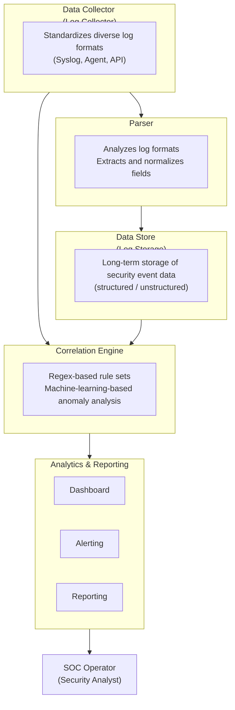

## I. Overview

**Definition**: A security operations system that collects, analyzes, and stores the security logs and events generated across an organization's various IT resources (servers, network equipment, applications, and more) in real time in order to detect and respond to threats.

**Features**:  
( **Visibility** ) Consolidates distributed log data to support a comprehensive view of a security incident and root-cause analysis when one occurs  
( **Real-Time Detection** ) Provides real-time threat detection and alerting by analyzing known attack patterns ( **Signature** ) and abnormal behavior ( **Anomaly** )  
( **Regulatory Compliance** ) Secures the log management and audit trails needed to satisfy compliance requirements such as the Personal Information Protection Act and ISMS-P  

## II. Mechanism & Components

| Function Area | Description | Security Value |
|---|---|---|
| **Log Collection & Normalization** | Converts logs from diverse sources into a standardized format | Increases ease of data integration and analysis |
| **Event Correlation Analysis** | Links patterns occurring across multiple logs to detect composite threats | Identifies early indicators and relationships within a breach |
| **Real-Time Monitoring** | Visualizes the state of security events through dashboards | Supports immediate threat detection and situational awareness |
| **Threat Detection & Alerting** | Detects suspicious activity via predefined rule sets or AI and issues an immediate alert | Enables rapid initial response when an incident occurs |
| **Forensic Analysis & Reporting** | Analyzes incident causes and generates reports by storing and searching event logs | Supports measures to prevent recurrence and satisfies audit requirements |

## III. Outlook & Future Direction

| Approach | Status | Direction |
|---|---|---|
| Rule-based correlation (signature) | Mature, still the baseline | Increasingly paired with ML-based anomaly scoring to cut false positives |
| On-premises SIEM | Common in regulated/legacy environments | Steadily losing ground to cloud-native, consumption-priced platforms |
| Standalone SIEM | Widely deployed today | Converging with EDR and SOAR into unified XDR/SOAR platforms |

The next SIEM refresh decision is really a data-volume-and-cost decision more than a detection-capability one — as log volume grows, what decides the platform is increasingly whether its pricing and storage model scales with ingest without forcing the SOC to quietly narrow what it collects. A SIEM too expensive to keep fully fed is a SIEM that's blind exactly where the next breach shows up.
