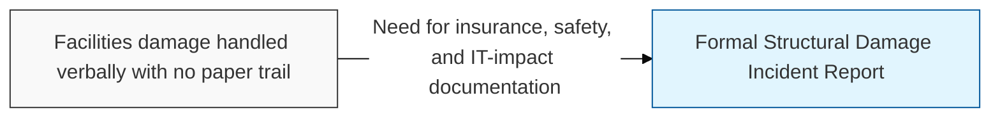
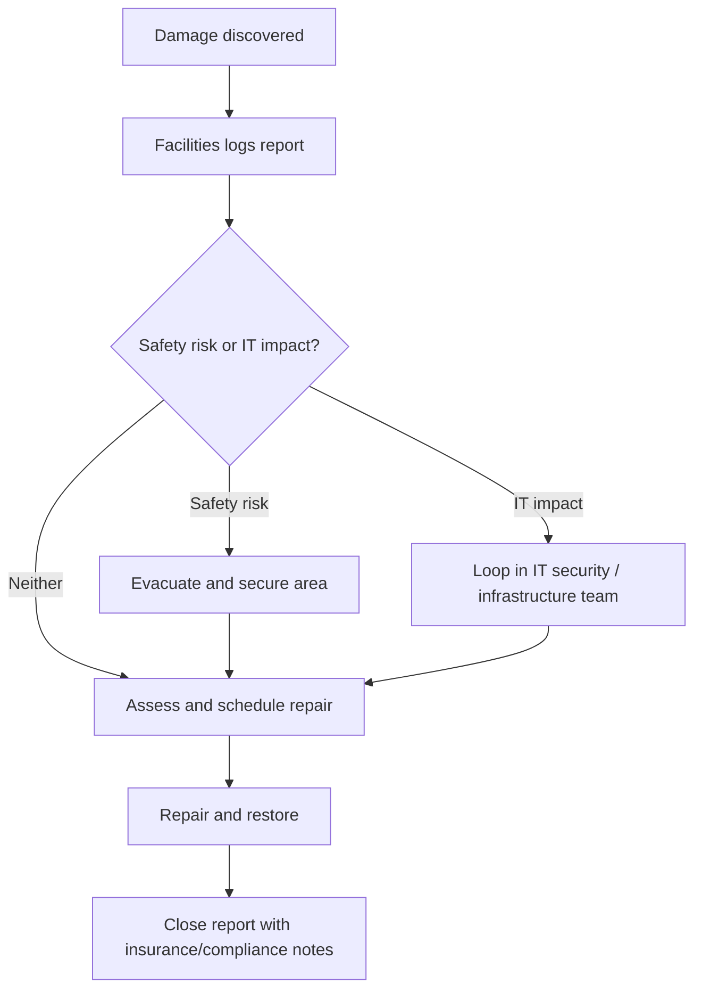

## I. Overview

The Structural Damage Incident Report documents physical damage to a building, data center, or piece of infrastructure — from a leak or fire to storm or equipment-related damage — and the immediate and corrective actions taken. It is owned by facilities management, with IT security looped in whenever the damaged area houses servers, network equipment, or physical access-control systems. Organizations need this record for insurance claims, safety compliance, and to ensure that damage affecting IT infrastructure triggers the appropriate availability and data-integrity response alongside the physical repair.

## II. Structure & Process

| Field | Description |
|---|---|
| Location & Date | Building, room, or facility affected and when the damage was discovered |
| Damage Type | Category, e.g. water, fire, structural collapse, storm, equipment failure |
| Reported By | Individual who first identified or reported the damage |
| Severity & Safety Risk | Assessment of whether the area is safe to occupy or requires evacuation |
| IT / Infrastructure Impact | Whether servers, network gear, or access-control systems are affected |
| Immediate Action | Steps taken to secure the area and prevent further damage |
| Repair & Restoration Plan | Vendor, timeline, and cost estimate for remediation |
| Insurance / Compliance Notes | Claim reference and any regulatory notifications required |

Facilities logs the report within hours of discovery, and IT security is notified immediately if the affected area houses infrastructure or physical access controls.

## III. Best Practices & Comparison

| Document | Primary Purpose | Trigger | Owner |
|---|---|---|---|
| Structural Damage Incident Report | Record physical damage to facilities or infrastructure | Physical damage discovered | Facilities |
| [Major Incident Report Template](../major-incident-report-template/) | Record a critical or high-severity security incident | Critical security event | SOC / IR Team |
| [Workplace Violence Report](../workplace-violence-report/) | Record threats or violence involving personnel | Threatening or violent conduct | HR / Security |

- Photograph or otherwise capture visual evidence of the damage before repairs begin.
- Assess IT infrastructure impact immediately, not only after physical repairs are scheduled.
- Route any damage affecting server rooms or access-control panels to IT security in parallel with facilities.
- File insurance claims and regulatory notifications within the required window, not after repairs complete.
- Retain repair vendor documentation for audit and warranty purposes.

Related: [Major Incident Report Template](../major-incident-report-template/), [Incident Management Process](../incident-management-process/)
