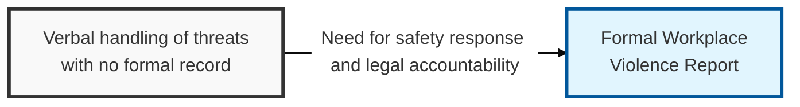
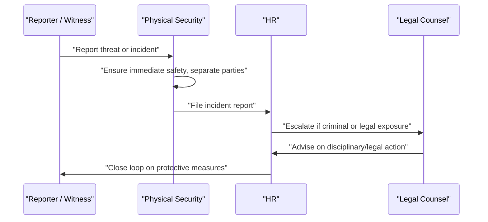

## I. Overview

**Definition**: The Workplace Violence Report documents any threat, altercation, or act of violence involving employees, contractors, or visitors, capturing what happened, who was involved, and what immediate and follow-up action was taken.

**Features**:  
( **Ownership** ) Jointly owned by HR and physical security.  
( **Legal Involvement** ) Legal counsel is involved for incidents that may carry criminal or employment-law implications.  
( **Duty of Care** ) Addresses the immediate safety, legal liability, and duty-of-care obligations these incidents carry.  
( **Accountability** ) Undocumented handling leaves the organization unable to demonstrate it responded appropriately.

## II. Structure & Process

| Field | Description |
|---|---|
| Date, Time & Location | When and where the incident occurred |
| Parties Involved | Names and roles of the individuals involved, including any witnesses |
| Incident Type | Category, e.g. verbal threat, physical altercation, weapon involved, intimidation |
| Description | Objective, factual account of what was said or done |
| Immediate Action Taken | Steps taken at the time (separation, security called, law enforcement notified) |
| Injuries / Medical Attention | Whether anyone was injured and what medical response occurred |
| HR / Legal Follow-up | Disciplinary action, legal referral, or protective measures put in place |
| Confidentiality Handling | Access restrictions applied to the report given its sensitivity |

Immediate safety takes priority over documentation; the written report is completed as soon as the situation is stabilized, and access to it is restricted to HR, security, and legal.

## III. Expected Benefits & Implications

| Benefit | Where It Shows Up |
|---|---|
| Demonstrable duty of care | Organization can show it responded appropriately if challenged legally |
| Consistent legal escalation | Nothing criminal or employment-law-relevant slips through informal handling |
| Protective follow-through | Documented confirmation that safety measures were actually implemented, not just promised |

A workplace violence report earns its value less as an HR record and more as evidence the organization took a threat seriously at the time, not just in hindsight — the follow-up field confirming a protective measure was actually implemented is the one practitioners most often skip, and it's precisely the field a plaintiff's attorney or auditor asks about first. Treat "follow-up confirmed" as a required close-out step, not an optional afterthought.

Related: [Intern Incident Report](../intern-incident-report/), [Structural Damage Incident Report](../structural-damage-incident-report/)
