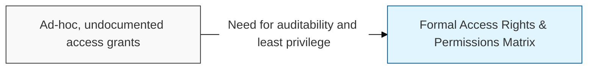
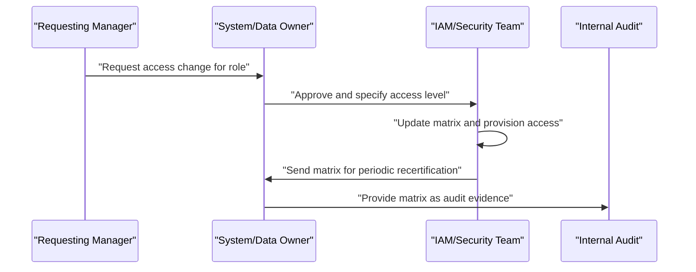

## I. Overview

An Access Rights & Permissions Matrix is a structured inventory that maps who (users, roles, or groups) can access which systems, applications, or data at what level of privilege. It is maintained jointly by system/application owners and the security or IAM (identity and access management) team, and reviewed by managers who approve access for their staff. Without it, organizations cannot answer basic audit questions — who has admin rights, whether access matches job function, or whether departed employees still hold active accounts — which makes it a baseline control for least privilege and segregation of duties.

## II. Structure & Process

| Field | Description |
|---|---|
| System/Application | The resource being controlled (ERP, file share, cloud console, database). |
| Role/Group | The job function or security group the entry applies to, not an individual by default. |
| Access Level | Permission tier granted, e.g. read, write, admin, or no access. |
| Business Justification | Why this role requires this level of access. |
| Approver | Manager or data owner who authorized the grant. |
| Grant Date | When access was provisioned. |
| Last Review Date | Date of the most recent recertification. |
| Review Frequency | Cadence for revalidation, e.g. quarterly for privileged accounts. |
| Revocation Trigger | Event that should remove access, e.g. role change or termination. |

The matrix is updated at every access request or role change and undergoes a full recertification on a fixed schedule, typically quarterly for privileged roles and semi-annually for standard access, with the system/data owner attesting that each entry is still required.

## III. Best Practices & Comparison

| Document | Primary Purpose | Update Cadence | Owner |
|---|---|---|---|
| Access Rights & Permissions Matrix | Track who has access to what, at what level | Continuous, with periodic recertification | IAM/Security team, system owners |
| Data Classification Register | Define sensitivity tiers that access levels should map to | Annual or on data inventory change | Data owners, security team |
| Data Loss Prevention (DLP) Incident Log | Record events where controlled data left approved boundaries | Per incident | Security operations |

- Grant access by role or group, not by individual exception, to keep the matrix maintainable.
- Tie every entry to a documented business justification and a named approver.
- Recertify privileged and administrative access more frequently than standard user access.
- Automate deprovisioning triggers from HR termination and transfer events rather than relying on manual cleanup.
- Cross-reference access levels against the [Data Classification Register](../data-classification-register/) so higher-sensitivity data always maps to stricter access tiers.

Related: [Data Classification Register](../data-classification-register/), [Security KPI Dashboard](../security-kpi-dashboard/).
