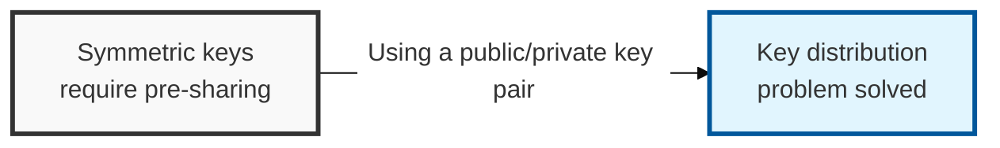
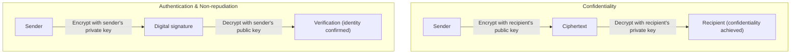

## I. Overview

**Definition**: A cryptographic scheme that uses a pair of keys — a **public key** and a **private key** — generated from a hard mathematical problem such as integer factorization or the discrete logarithm problem.

**Features**:  
( **Easy Key Distribution** ) The public key can be distributed openly, making key management far simpler than with symmetric-key cryptography  
( **Confidentiality and Non-repudiation** ) Alongside confidentiality through data encryption, it provides non-repudiation via digital signatures  
( **Computational Complexity** ) Because it relies on complex operations grounded in hard mathematical problems, it is relatively slower than symmetric-key cryptography  

## II. Mechanism & Components

### A. Confidentiality and Authentication (Digital Signature) Process

**Detailed mechanism**:
- **Confidentiality**: Encrypted with the recipient's public key → only decryptable with the recipient's private key
- **Authentication and non-repudiation**: Encrypted (signed) with the sender's private key → anyone can decrypt (verify) it with the sender's public key

### B. Major Algorithms and Their Mathematical Hard Problems

| Algorithm | Underlying Hard Problem | Features & Use |
|----------|----------------|-------------|
| **RSA** | Integer factorization | The most widely used algorithm; key lengths trend longer over time (2048 bits or more) |
| **ECC** | Elliptic Curve Discrete Logarithm Problem (ECDLP) | Provides the same security strength as RSA with a much shorter key (ideal for mobile/IoT) |
| **Diffie-Hellman** | Discrete logarithm | A key-exchange-only algorithm, used in the early stages of SSL/TLS |
| **ElGamal** | Discrete logarithm | Has the drawback that ciphertext grows to twice the size of the plaintext |

## III. Advanced Topics & Comparison

| Comparison Item | Symmetric-Key Cryptography | Asymmetric-Key Cryptography |
|----------|------------|--------------|
| **Number of Keys** | 1 (shared secret key) | 2 (public key, private key) |
| **Key Distribution** | Difficult (requires pre-sharing) | Very easy (public key can be distributed) |
| **Computation Speed** | Fast (suited to large volumes) | Slow (roughly 100–1,000x slower) |
| **Core Use** | Encrypting the data body | Key exchange, digital signatures, authentication |
