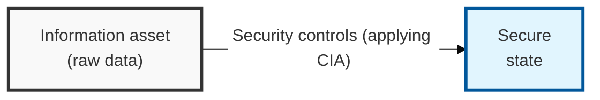
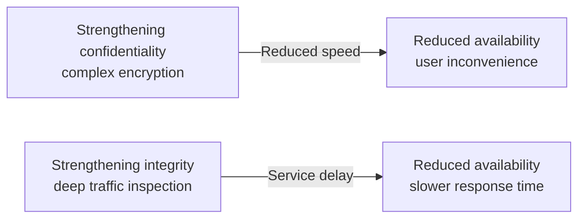

## I. Overview

**Definition**: The state achieved by putting physical, technical, and administrative measures in place to preserve the confidentiality, integrity, and availability of information assets.

**Core Security Elements**:  
( **Confidentiality** ) Preventing eavesdropping and leakage so that only authorized users can access information  
( **Integrity** ) The state in which information is guaranteed to be accurate and complete, unaltered by unauthorized parties  
( **Availability** ) The state in which authorized users can access information and services whenever they need them  

## II. Mechanism & Components

### A. Detailed Comparison of Confidentiality, Integrity, and Availability

| Category | Confidentiality | Integrity | Availability |
|------|------------------------|------------------|----------------------|
| Definition | Only authorized users can access information | Information is not illegally altered | Information and services can be used whenever needed |
| Core Goal | Preserving secrecy | Guaranteeing accuracy and completeness | Ensuring service continuity |
| Security Threats | Eavesdropping, social engineering, sniffing | Message tampering, replay attacks | DoS/DDoS, ransomware, physical destruction |
| Countermeasures | Encryption, access control, DRM | Hash functions, digital signatures, MAC | Backups, redundancy (DR/BCP), load balancing |

## III. Key Strategies for Successful Adoption

| Strategy | Application | Risk If Skipped |
|---|---|---|
| Risk-based design | Apply differentiated security levels by asset value — confidentiality-first for financial data, availability-first for process control systems | Over-securing low-value assets while under-protecting critical ones |
| Defense in depth | Layer controls across tiers so a single compromised element doesn't collapse the whole triad | One control failure cascades into a full security breakdown |

Treating CIA as three properties to maximize simultaneously is the most common mistake in control design — nearly every meaningful security decision is actually a trade-off among them, and the real job is choosing which one to protect hardest for a given asset rather than pretending the trade-off doesn't exist. A control proposal that boosts confidentiality or integrity without an explicit accounting of its availability cost should not clear architecture review.
