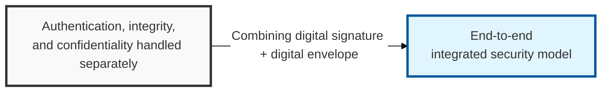
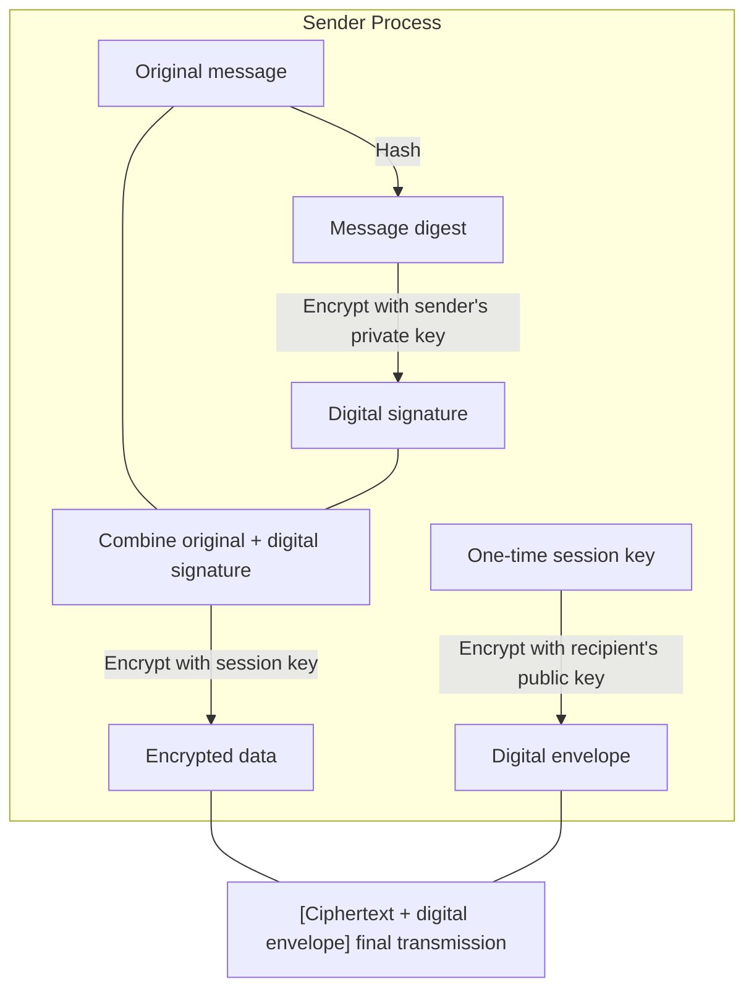

## I. Overview

**Definition**: A mechanism that combines the authentication, integrity, and non-repudiation functions of a digital signature with the confidentiality function of a digital envelope to secure the entire transmission path.

**Necessity**:  
( **End-to-End Integrated Security** ) Authentication, integrity, non-repudiation, and confidentiality are all secured simultaneously, completing protection across the full path  
( **Defense Against Sender Impersonation** ) The digital signature verifies the sender's identity, blocking impersonation by others at the source  
( **Prevention of Replay Attacks** ) Combining a one-time session key with the signature defends against message reuse and tampering  

## II. Mechanism & Components

### A. Sender-Side Processing (Sign-then-Encrypt)

**Detailed steps**:
- **Generate digital signature**: The original message is hashed, then the digest is encrypted with the sender's private key to produce a signature value
- **Combine message**: The digital signature is attached to the original message
- **Encrypt data**: The combined data is encrypted with a one-time **symmetric key** (session key)
- **Generate digital envelope**: The session key used is encrypted with the recipient's public key to form the digital envelope
- **Final transmission**: [Encrypted data + digital envelope] is delivered to the recipient

### B. Mapping to Security Functions

| Security Requirement | Implementing Technology | Detailed Mechanism |
|:---:|:---:|-----------|
| **Confidentiality** (C) | Digital envelope | Decryptable only via the session key, which is encrypted with the recipient's public key |
| **Integrity** (I) | Hash function | If even a single bit of the message changes, the hash result changes |
| **Authentication** (A) | Digital signature | If the signature decrypts successfully with the sender's public key, the sender's identity is confirmed |
| **Non-repudiation** (N) | Asymmetric key | Because only the sender holds the private key used to sign, the sender cannot deny having sent the message |

## III. Advanced Topics & Comparison

| Consideration | Details & Response Strategy |
|:---:|-------------------|
| **Computational Load** | Asymmetric-key operations occur twice (signing, enveloping), so adopting a high-performance accelerator (HSM) should be considered |
| **Certificate Validity** | Before verifying a signature, certificate revocation status must always be checked first via the CRL or OCSP |
| **Standard Protocols** | Standardized mechanisms are used in **S/MIME**, **PGP**, and electronic tax-invoice systems |
