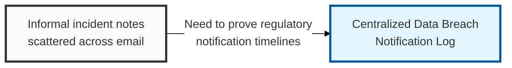
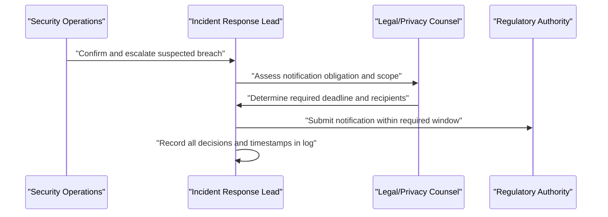

## I. Overview

**Definition**: A Data Breach Notification Log is the authoritative record of confirmed data breaches: what happened, who was affected, which regulators or individuals were notified, and when.

**Features**:  
( **Ownership** ) Owned by the CISO or incident response lead, with input from legal/privacy counsel who determine notification obligations.  
( **Regulatory Window** ) Many breach notification regulations require disclosure to a supervisory authority within a tight window, commonly cited as 72 hours from confirmed discovery.  
( **Compliance Evidence** ) Exists to prove that timeline was met, or to explain any deviation, during a regulatory inquiry.

## II. Structure & Process

| Field | Description |
|---|---|
| Incident ID | Unique reference linking to the broader incident response record. |
| Discovery Date/Time | When the breach was first confirmed, which starts the notification clock. |
| Data Categories Affected | Types of data exposed, e.g. personal identifiers, financial, health. |
| Estimated Affected Individuals | Count or estimate of impacted data subjects. |
| Root Cause | Summary of how the breach occurred. |
| Regulatory Notification Status | Whether and when the relevant authority was notified. |
| Individual Notification Status | Whether and when affected individuals were informed. |
| Notification Deadline | Regulatory or contractual deadline applicable to the incident. |
| Remediation Actions | Containment and corrective steps taken. |

Entries are created the moment a breach is confirmed, updated continuously through containment and notification, and formally closed once all required disclosures are complete and remediation is verified.

## III. Best Practices & Comparison

| Document | Primary Purpose | Update Cadence | Owner |
|---|---|---|---|
| Data Breach Notification Log | Track breach disclosure obligations and deadlines | Per incident | CISO/incident response lead |
| Data Loss Prevention (DLP) Incident Log | Track all data-exfiltration events, not only confirmed breaches | Per incident | Security operations |
| Data Classification Register | Define which data categories trigger notification obligations | Annual or on data inventory change | Data owners, security team |

- Start the notification clock from confirmed discovery, not from initial suspicion, and document that timestamp precisely.
- Involve legal/privacy counsel early to determine jurisdiction-specific obligations rather than assuming a single global deadline.
- Keep the log separate from general incident tickets so regulatory evidence is not buried in unrelated operational detail.
- Record both regulator and individual notification separately, since deadlines and thresholds often differ.
- Review closed entries during tabletop exercises to validate that response times can meet stated deadlines.

Related: [Data Loss Prevention (DLP) Incident Log](../data-loss-prevention-incident-log/), [Data Classification Register](../data-classification-register/).
