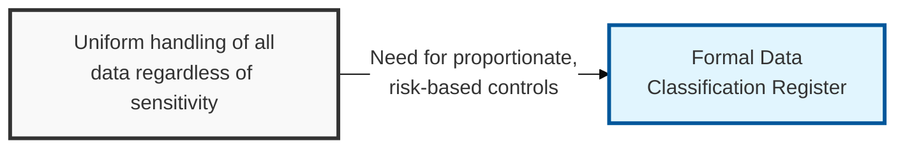
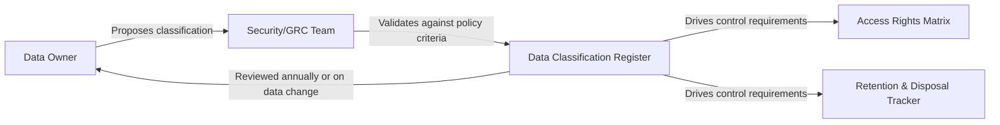

## I. Overview

**Definition**: A Data Classification Register catalogs an organization's data assets and assigns each a sensitivity tier — such as public, internal, confidential, and restricted — based on the confidentiality impact of unauthorized disclosure.

**Features**:  
( **Ownership** ) Maintained by data owners with guidance from the security team.  
( **Control Foundation** ) Underpins nearly every other control, since access rights, encryption requirements, retention periods, and breach notification scope all key off the classification assigned here.  
( **Proportionate Risk** ) Keeps controls proportionate to actual risk instead of applied uniformly, either too loose on sensitive data or too costly on trivial data.

## II. Structure & Process

| Field | Description |
|---|---|
| Data Asset/System | The dataset, repository, or system holding the data. |
| Classification Tier | Assigned sensitivity level, e.g. public, internal, confidential, restricted. |
| Data Owner | Individual or team accountable for the asset's classification and handling. |
| Regulatory Scope | Applicable regulations, e.g. privacy law, sector-specific rules. |
| Handling Requirements | Required controls at this tier: encryption, masking, access restrictions. |
| Storage Location | Where the data physically or logically resides. |
| Retention Reference | Link to the applicable retention schedule entry. |
| Last Reviewed | Date the classification was last validated. |

Classification is assigned when a data asset is created or onboarded, re-validated whenever its content or regulatory scope materially changes, and formally reviewed on an annual cycle by the data owner in coordination with security.

## III. Best Practices & Comparison

| Document | Primary Purpose | Update Cadence | Owner |
|---|---|---|---|
| Data Classification Register | Define sensitivity tiers for all data assets | Annual or on data inventory change | Data owners, security team |
| Access Rights & Permissions Matrix | Enforce access controls proportionate to classification | Continuous | IAM/Security team |
| Document Retention & Disposal Tracker | Define how long each classified asset is kept and how it is disposed | Annual | Records management, legal |

- Use a small, fixed set of tiers (typically three to four) rather than a granular scale that becomes impractical to apply consistently.
- Assign a named data owner per asset, not a department, so accountability for classification decisions is unambiguous.
- Where feasible, apply pseudonymization or masking techniques to reduce classification tier and expand safe reuse of data for analytics.
- Re-classify data whenever it is aggregated, combined, or repurposed, since combined datasets can raise re-identification risk beyond the original tier.
- Feed classification tiers directly into access and retention decisions instead of maintaining them as separate, disconnected judgments.

Related: [Access Rights & Permissions Matrix](../access-rights-permissions-matrix/), [Document Retention & Disposal Tracker](../document-retention-disposal-tracker/).
