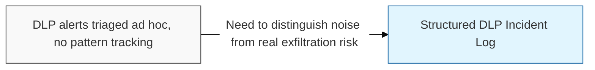
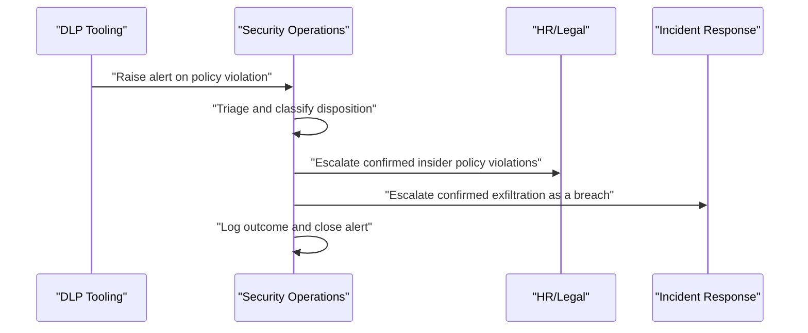

## I. Overview

A **DLP** (Data Loss Prevention) Incident Log records every event flagged by DLP tooling or manual detection where classified data moved, or attempted to move, outside approved boundaries — email exfiltration, unauthorized uploads, removable media transfers, and similar policy violations. It is maintained by the security operations team, with escalation paths to HR and legal for policy violations involving insiders. It matters because most DLP alerts are false positives or minor mistakes rather than breaches, and this log is what lets a team separate routine noise from patterns that indicate a genuine control gap or malicious insider activity.

## II. Structure & Process

| Field | Description |
|---|---|
| Alert ID | Unique identifier from the DLP tool or ticketing system. |
| Detection Channel | Where the event was flagged, e.g. email, endpoint, cloud storage, USB. |
| Data Classification Involved | Sensitivity tier of the data implicated in the alert. |
| User/Device | Individual or asset associated with the triggering action. |
| Disposition | Outcome of triage: false positive, policy violation, confirmed exfiltration. |
| Severity | Assigned risk level based on data sensitivity and intent. |
| Action Taken | Response, e.g. block, user coaching, HR referral, escalation to breach process. |
| Repeat Occurrence | Whether the same user/device has prior entries. |

Each alert is logged at detection and closed once triaged, typically within one business day; the log itself is reviewed weekly by security operations and summarized monthly for management reporting.

## III. Best Practices & Comparison

| Document | Primary Purpose | Update Cadence | Owner |
|---|---|---|---|
| Data Loss Prevention (DLP) Incident Log | Track detected exfiltration attempts and policy violations | Per alert | Security operations |
| Data Breach Notification Log | Track confirmed breaches requiring regulatory disclosure | Per confirmed breach | CISO/incident response lead |
| Access Rights & Permissions Matrix | Reduce exfiltration risk by limiting who can access sensitive data | Continuous | IAM/Security team |

- Triage every alert to a clear disposition rather than leaving items open indefinitely, which erodes the log's usefulness for trend analysis.
- Track repeat occurrences per user or device to catch patterns a single alert would miss.
- Escalate any confirmed exfiltration of classified data into the breach notification process immediately, not after routine review.
- Tune DLP rules based on false-positive trends visible in the log to reduce alert fatigue over time.
- Report aggregate metrics (alert volume, false-positive rate, mean time to triage) into the [Security KPI Dashboard](../security-kpi-dashboard/) rather than only tracking individual incidents.

Related: [Data Breach Notification Log](../data-breach-notification-log/), [Security KPI Dashboard](../security-kpi-dashboard/).
