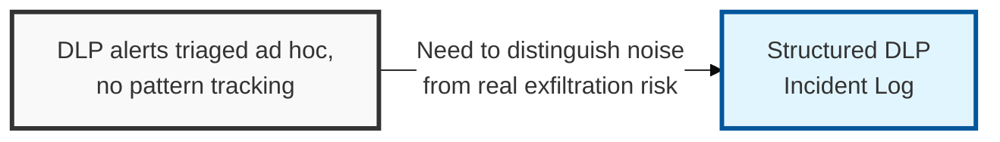
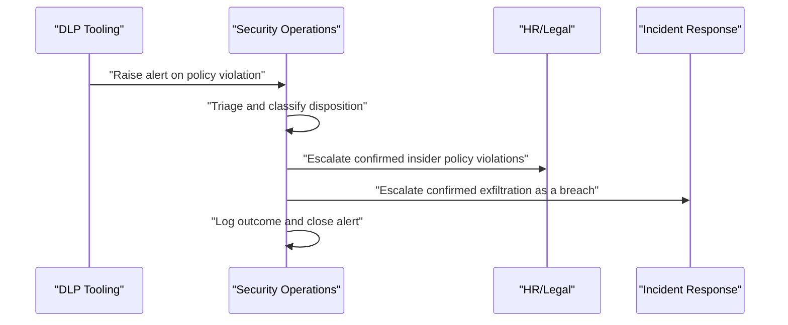

## I. Overview

**Definition**: A **DLP** (Data Loss Prevention) Incident Log records every event flagged by DLP tooling or manual detection where classified data moved, or attempted to move, outside approved boundaries.

**Features**:  
( **Ownership** ) Maintained by the security operations team, with escalation paths to HR and legal for policy violations involving insiders.  
( **Event Coverage** ) Spans email exfiltration, unauthorized uploads, removable media transfers, and similar policy violations.  
( **Noise Filtering** ) Separates routine noise, since most DLP alerts are false positives or minor mistakes rather than breaches, from patterns that indicate a genuine control gap.  
( **Insider Risk** ) Surfaces patterns that indicate malicious insider activity.

## II. Structure & Process

| Field | Description |
|---|---|
| Alert ID | Unique identifier from the DLP tool or ticketing system. |
| Detection Channel | Where the event was flagged, e.g. email, endpoint, cloud storage, USB. |
| Data Classification Involved | Sensitivity tier of the data implicated in the alert. |
| User/Device | Individual or asset associated with the triggering action. |
| Disposition | Outcome of triage: false positive, policy violation, confirmed exfiltration. |
| Severity | Assigned risk level based on data sensitivity and intent. |
| Action Taken | Response, e.g. block, user coaching, HR referral, escalation to breach process. |
| Repeat Occurrence | Whether the same user/device has prior entries. |

Each alert is logged at detection and closed once triaged, typically within one business day; the log itself is reviewed weekly by security operations and summarized monthly for management reporting.

## III. Adoption Considerations

| Adoption Risk | Description | Mitigating Practice |
|---|---|---|
| Alert fatigue | High false-positive volume causes alerts to be dispositioned superficially | Tune DLP rules against logged false-positive trends, not intuition |
| Unclosed dispositions | Alerts left open indefinitely erode trend visibility | Force every alert to a clear disposition before closure |
| Siloed insider signals | Repeat low-severity events from the same user go unnoticed individually | Track repeat occurrence per user/device across the full log history |

The log's real job is separating noise from pattern, and most teams under-invest in the second half of that job — a single DLP alert is rarely meaningful, but three low-severity alerts from the same user over a month is a different risk category entirely, one a per-alert triage process will never surface on its own. Building repeat-occurrence tracking into the triage workflow, not just the disposition field, is what actually catches insider risk.

- Triage every alert to a clear disposition rather than leaving items open indefinitely.
- Escalate any confirmed exfiltration of classified data into the breach notification process immediately, not after routine review.
- Report aggregate metrics (alert volume, false-positive rate, mean time to triage) into the [Security KPI Dashboard](../security-kpi-dashboard/) rather than only tracking individual incidents.

Related: [Data Breach Notification Log](../data-breach-notification-log/), [Security KPI Dashboard](../security-kpi-dashboard/).
