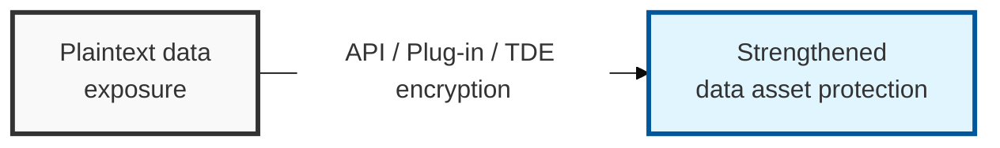
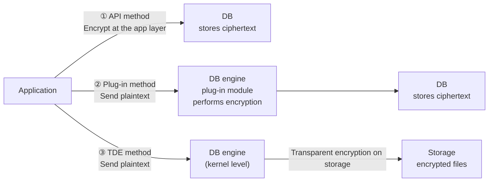

## I. Overview

**Definition**: A technique that uses encryption algorithms to store sensitive fields within a database (such as resident registration numbers or passwords) in a form unreadable by unauthorized parties.

**Necessity**:  
( **Asset Protection** ) Encrypting sensitive information within the database blocks access by unauthorized parties  
( **Compliance** ) Meets legal and regulatory requirements such as personal data protection laws and prepares the organization for security audits  
( **Preventing Administrative Misuse** ) Restricts even privileged administrators from directly accessing encrypted data, preventing leakage  

## II. Mechanism & Components

### A. Encryption Architecture and Comparison by Type

> **Key point**: The methods are distinguished by which layer performs the encryption — the **application (API)**, the **DB server (Plug-in)**, or the **storage layer (TDE)**.

### B. Detailed Comparison by Method

| Category | API Method | Plug-in Method | TDE (Transparent Data Encryption) |
|------|---------|------------|----------------------------------|
| Executing Entity | Application server | DB server (separate module) | DB server (kernel/engine level) |
| Encryption Point | Encrypted at the app layer before transmission | Processed inside the DB engine | Processed when the data file is stored |
| Application Changes | Required (API calls) | Almost none (View/Trigger) | Not required |
| Performance Impact | Low load on the DB server | Possible load on the DB server | Low load due to in-engine optimization |
| Index Usage | Exact-match search only | Limited usability | All indexes usable |

## III. Advanced Topics & Comparison

An architect must be able to propose the optimal combination (hybrid approach) for the operating environment, selecting among the following criteria.

| Selection Criterion | Optimal Method | Reason |
|----------|---------|------|
| Preserving Legacy Systems | TDE / Plug-in | Minimizes the cost and risk of modifying source code |
| Strong End-to-End Security | API | Data is encrypted before it ever travels across the network |
| Performance First (High Volume) | TDE | Optimized via hardware acceleration (AES-NI) and full index usability |
