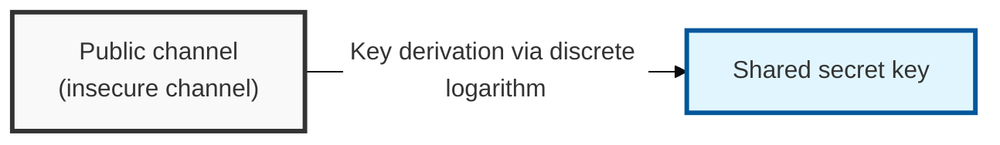
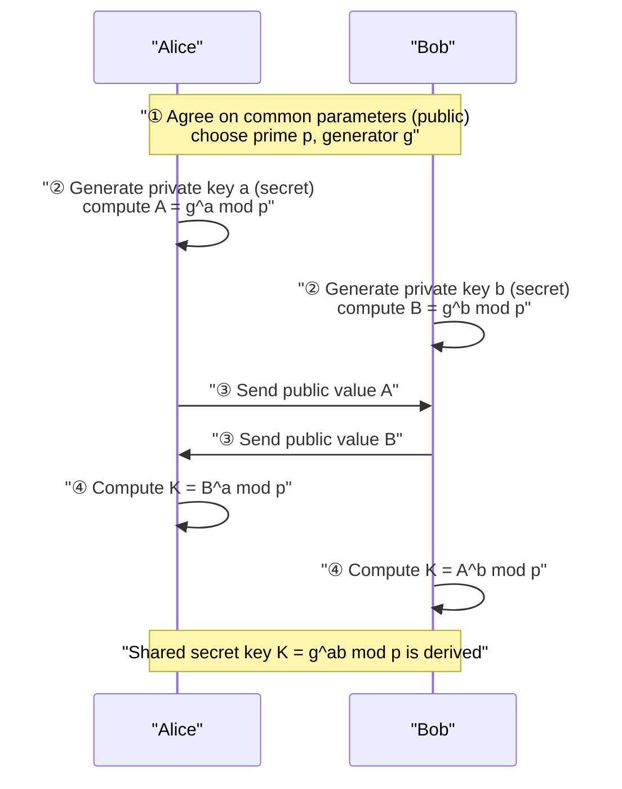
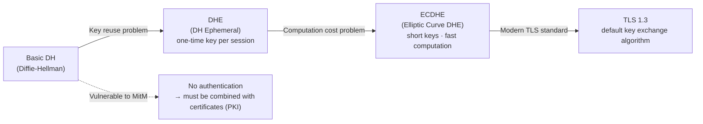

## I. Overview

**Definition**: A cryptographic algorithm that, based on the computational difficulty of the discrete logarithm problem, allows communicating parties to derive a common secret key over a public channel without ever sharing their private keys.

**Key Features**:  
( **Solves the Key Distribution Problem** ) A session key can be derived securely without needing to share a key in advance  
( **The First Public-Key-Based Scheme** ) Published in 1976, it was the first public-key cryptographic algorithm and the starting point of modern cryptography  
( **Based on the Discrete Logarithm** ) Relies on the mathematical principle that reversing exponentiation over a finite field is computationally hard  

## II. Mechanism & Components

### A. Key Exchange Process (Alice & Bob)

**Step-by-step description**:

1. **Agree on common parameters**: A large prime `p` and a generator `g` are chosen publicly
2. **Generate private keys**: Alice generates a random private key `a`, and Bob generates `b` (both secret)
3. **Compute and exchange public values**:
   - Alice computes `A = g^a mod p` and sends it to Bob
   - Bob computes `B = g^b mod p` and sends it to Alice
4. **Derive the shared secret key**:
   - Alice computes `K = B^a mod p = (g^b)^a mod p`
   - Bob computes `K = A^b mod p = (g^a)^b mod p`
   - As a result, both sides hold the identical `K = g^ab mod p`

### B. Security Characteristics

| Item | Description |
|-----|------|
| Mathematical Basis | The discrete logarithm problem — even knowing `Y` in `g^x mod p = Y`, computing `x` is computationally infeasible |
| Perfect Forward Secrecy (PFS) | When ephemeral keys are used, past communications cannot be decrypted even if the server's long-term private key is later compromised |
| Weakness | Vulnerable to **man-in-the-middle (MitM) attacks** — since it provides no authentication, the identity of the other party cannot be confirmed |

## III. Advanced Topics & Comparison

| Model | Features | Security Strength | Status |
|-----|------|---------|------|
| DH | Fixed key use, simple implementation | Low (key reuse) | Legacy |
| DHE | Generates an ephemeral key each session → provides PFS | High | Recommended |
| ECDHE | Applies elliptic-curve (ECC) cryptography → same security strength with shorter keys, faster computation | Very high | **Modern TLS standard** |

> **Key point**: ECDHE delivers both high security strength and PFS with a short key length (256-bit ≈ RSA 3072-bit), which is why it was adopted as the default key exchange method in TLS 1.3.
