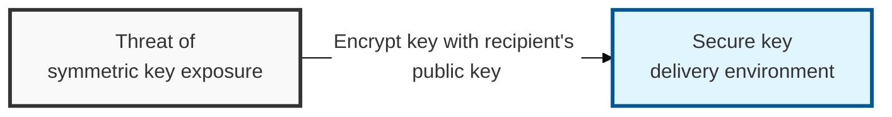
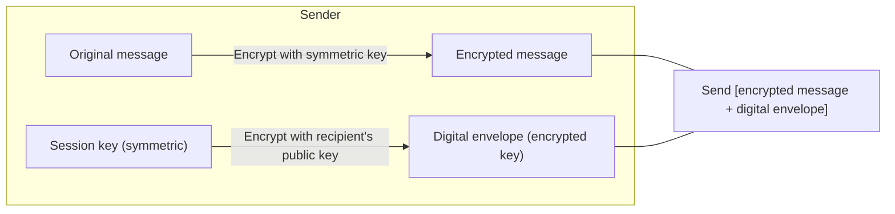

## I. Overview

**Definition**: The core mechanism of a hybrid cryptographic system that combines a symmetric key — for quickly processing large volumes of data — with **asymmetric-key** (public-key) cryptography for safely distributing that key.

**Features**:  
( **Confidentiality Assured** ) Data can only be recovered via a session key encrypted with the recipient's public key  
( **Key Management Efficiency** ) Using a one-time session key reduces the risk of key exposure and improves management convenience  
( **Hybrid Structure** ) Combines the speed of symmetric-key cryptography with the safe key distribution of asymmetric-key cryptography  

## II. Mechanism & Components

### A. Digital Envelope Generation and Transmission (Sender Side)

**Detailed steps**:
- **Generate secret key**: A one-time symmetric key (session key) is randomly generated to encrypt the data
- **Encrypt message**: The original message is encrypted with the generated session key (`C = E_Symmetric(Msg)`)
- **Generate digital envelope**: The session key itself is encrypted using the recipient's **public key** (`Envelope = E_Public(Key)`)
- **Transmission**: The encrypted message and the digital envelope are sent together

### B. Digital Envelope Decryption (Recipient Side)

- **Recover session key**: The recipient uses their own **private key** to decrypt the digital envelope and obtain the session key
- **Recover message**: The obtained session key is used to decrypt the encrypted message and recover the original

## III. Advanced Topics & Comparison

| Category | Key Feature | Security Property & Expected Benefit |
|:---:|----------|----------------------|
| **Efficiency** | Suited to transferring large volumes of data | Guaranteed computation speed via symmetric algorithms (AES, etc.) |
| **Safety** | Prevents key-theft threats | The session key can only be recovered with the recipient's private key (**confidentiality**) |
| **One-time Use** | A new key is generated per session | Even if a key is exposed, only that session's data is affected |
| **Use Cases** | Email, financial payments, etc. | Used in standard protocols such as S/MIME, PGP, and SSL/TLS |
