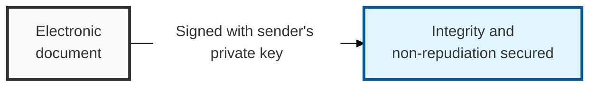
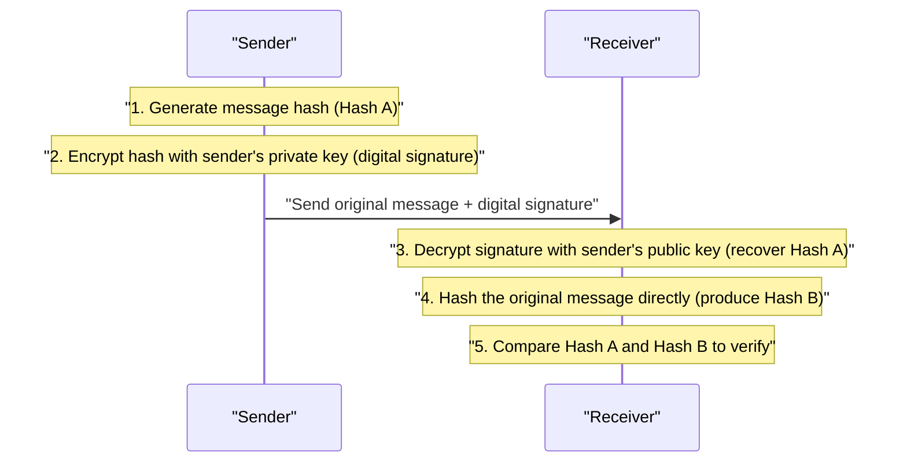

## I. Overview

**Definition**: A technique in which the sender encrypts the hash value of an electronic document with their own **private key** and attaches it to the document, serving as an electronic equivalent of a personal seal.

**Core Value**:  
( **Integrity** ) Proves that data has not been forged or altered in transit  
( **Authentication** ) Confirms and guarantees the signer's identity  
( **Non-repudiation** ) Provides legal and technical evidence so the signer cannot later deny having signed  

## II. Mechanism & Components

### A. Digital Signature Generation and Verification Process

**Detailed steps**:
- **Generate signature**: The original message is reduced via a hash function, then encrypted with the sender's private key to produce the signature
- **Transmit**: The original message and the digital signature are sent to the recipient together
- **Verify signature**: The recipient decrypts the signature with the sender's public key to obtain hash value A, and independently hashes the original message to obtain hash value B
- **Compare**: If hash values A and B match, the signature is valid and the document has not been tampered with

### B. Five Core Security Functions of a Digital Signature

| Security Function | Description | Implementation |
|:---:|----------|----------|
| **Authentication** | Confirms who the signer is | Authenticated on successful decryption with the sender's public key |
| **Integrity** | Confirms whether the document was forged or altered | Tampering is detected by comparing hash values |
| **Non-repudiation** | The signer cannot later deny the signature | Evidenced by use of a private key that only the sender holds |
| **Non-reusability** | The signature cannot be reused on another document | A unique hash value is generated per document |
| **Immutability** | Any change to the document after signing invalidates the signature | Relies on the collision resistance of the hash algorithm |

## III. Outlook & Future Direction

| Category | Accredited Certification Regime (Past) | Simple Authentication / Decentralized ID (Present) |
|:---:|-------------------------|-----------------------|
| **Legal Status** | Exclusive legal status for accredited certificates | Equal legal effect granted to all digital signatures |
| **Authentication Technology** | PKI-based, hard-coded methods | FIDO (biometric), cloud authentication, DID (blockchain) |
| **User Experience** | ActiveX, complex passwords | Fingerprint, facial recognition, simple PIN |
| **Security Trend** | Centralized CA management | Quantum-resistant signatures (PQC), distributed trust models |

The shift away from accredited-certificate exclusivity was as much a usability correction as a security one — ActiveX-based signing collapsed under its own friction long before any cryptographic weakness forced the issue, and FIDO-based schemes won by being both easier and no less trustworthy. The next forcing function is quantum resistance: expect signature schemes to migrate to PQC algorithms (Dilithium, SPHINCS+) well ahead of encryption schemes, since a forged signature is exploitable the moment a quantum computer exists, with none of the "harvest now, decrypt later" grace period that encrypted data gets.
