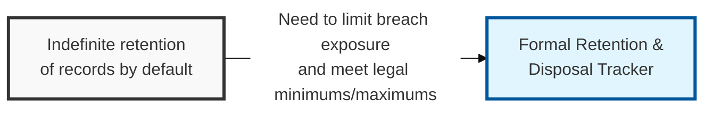
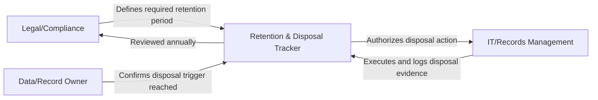

## I. Overview

**Definition**: A Document Retention & Disposal Tracker specifies how long each category of record must be kept to satisfy legal, contractual, or operational needs, and how it must be securely disposed of once that period expires.

**Features**:  
( **Ownership** ) Jointly owned by records management, legal, and the security team, since retention periods are driven by regulatory requirements while disposal methods are a security control.  
( **Exposure Reduction** ) Limits the breach exposure and audit burden created by data kept beyond its necessary lifespan without offsetting business value.  
( **Blast Radius** ) Minimizing retained data is one of the most effective ways to shrink the blast radius of a future incident.

## II. Structure & Process

| Field | Description |
|---|---|
| Record Category | Type of record, e.g. financial, HR, customer transaction, security log. |
| Classification Reference | Link to the corresponding entry in the Data Classification Register. |
| Retention Period | Minimum or maximum time the record must be kept. |
| Legal/Regulatory Basis | Requirement driving the retention period. |
| Disposal Method | Required secure disposal action, e.g. cryptographic erasure, physical destruction. |
| Disposal Trigger | Event that starts the countdown to disposal, e.g. contract end date. |
| Responsible Party | Team or role accountable for executing disposal. |
| Last Disposal Action | Date and evidence of the most recent completed disposal. |

The tracker is updated whenever a new record category is onboarded or a regulation changes, and disposal actions are executed on a recurring schedule (commonly quarterly) once a record's retention period and disposal trigger have both been met, with evidence of destruction logged for audit purposes.

## III. Adoption Considerations

| Adoption Risk | Description | Mitigating Practice |
|---|---|---|
| Indefinite retention by default | "Keep everything" becomes the unstated policy without an explicit tracker | Set explicit minimum and maximum retention periods per record category |
| Soft deletion mistaken for disposal | Simple deletion leaves recoverable data on backups and storage | Tie disposal method to classification tier — cryptographic or physical destruction for restricted data |
| Missing disposal evidence | No proof destruction occurred when auditors or regulators ask | Capture certificates, logs, and timestamps at the moment of destruction |

The tracker's actual security value is shrinking the blast radius of a breach that hasn't happened yet, and that only works if disposal triggers are automated rather than tracked manually — a record category with a defined retention period but no enforced trigger is functionally identical to having no retention policy at all. Treat automating the disposal trigger, not defining the retention period itself, as the harder and more important half of this control.

- Set both minimum and maximum retention periods explicitly.
- Tie disposal methods to the data's classification tier so restricted data receives cryptographic or physical destruction, not simple deletion.
- Review the tracker whenever the Data Classification Register changes, as reclassified data may carry different retention obligations.

Related: [Data Classification Register](../data-classification-register/), [Data Breach Notification Log](../data-breach-notification-log/).
